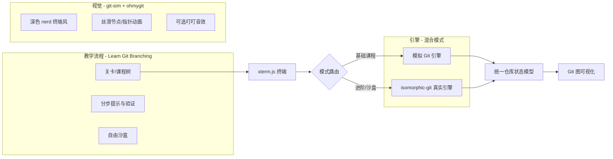
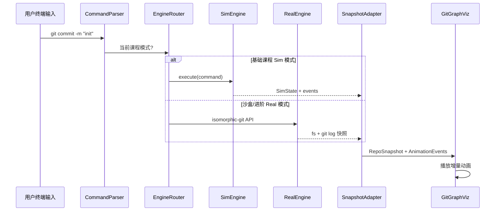

# Git 命令行教学网站 — 技术方案

## 核心结论：Manim 能否在纯前端运行？

**能跑，但不适合作为本项目的交互可视化引擎。**

| 方案 | 可行性 | 问题 |
|------|--------|------|
| ManimCE + Pyodide (`manim-web` Python 版) | 技术上可以 | 首次加载 ~10MB+、冷启动慢、文字渲染受限、每次命令都要重建 Scene |
| `manim-web` TypeScript 版 (Three.js) | 浏览器原生运行 | API 面向数学讲解场景，不是状态驱动的 Git 图；交互式增量更新很别扭 |
| git-sim 的做法 | 离线渲染 JPG/MP4 | Python CLI 工具，**不是网页**；敲命令后等几秒出图/视频 |

git-sim 好看，是因为 Manim 擅长「预设好的一镜到底动画」。你的需求是「敲 `git commit` → 右侧图立刻平滑变化」，这是 **状态机 + 增量动画** 问题，用 **SVG/Canvas + Motion 或 GSAP** 更合适，加载快、可交互、可精确控制每个 commit 圆点、分支指针、remote 箭头的运动轨迹。

你已选择：**交互优先，用 Web 动画复刻 git-sim 视觉风格** — 这是正确方向。

---

## 产品形态：三家参考各取所长



| 参考项目 | 借鉴什么 | 不照搬什么 |
|----------|----------|------------|
| [Learn Git Branching](https://learngitbranching.js.org/?locale=zh_CN) | 左终端右可视化布局、关卡树、`levels` 命令、命令验证逻辑、remote 专题结构 | 偏旧的 CSS 美术 |
| [git-sim](https://github.com/initialcommit-com/git-sim) | 深色配色、commit 圆点、分支标签、箭头粗细、merge/rebase 动画节奏 | 离线 Manim 渲染流程 |
| [ohmygit](https://ohmygit.org/) | 操作反馈音效、motion 的「教学感」 | 偏卡通/不规整美术（你要 nerd 调性） |
| [understanding-git](https://github.com/vindard/understanding-git) / [gitvana](https://github.com/pixari/gitvana) | isomorphic-git 集成、xterm.js、课程验证架构 | 直接复用代码需改视觉层 |

---

## 页面布局

```
┌──────────────────────────────────────────────────────────────┐
│ 顶栏：课程名 · 进度 · 模式标签(Sim/Real) · 重置              │
├─────────────────┬────────────────────────────────────────────┤
│  课程说明区      │                                            │
│  (当前步骤/提示) │         Git 仓库可视化画布                  │
├─────────────────┤         · commit 节点 (hash 缩写)           │
│                 │         · 分支/ref 标签 (main, feature)     │
│  xterm.js 终端  │         · HEAD 指针动画                     │
│  + Tab 自动补全  │         · origin 远端镜像区 (remote 课)   │
│  + 命令历史      │         · 可选：staging/working 三区示意     │
├─────────────────┤                                            │
│  文件状态面板    │                                            │
│  (工作区/暂存区) │                                            │
└─────────────────┴────────────────────────────────────────────┘
```

- 用 [allotment](https://github.com/johnwalley/allotment) 或类似库实现可拖拽分栏（参考 understanding-git）
- 终端宽度约 35%，可视化约 65%，与 LGB 比例接近

---

## 技术栈建议

当前仓库几乎是空的（仅 [TODO.md](TODO.md)），建议从零搭建：

- **框架**：React 19 + TypeScript + Vite（生态成熟，xterm/isomorphic-git 集成案例多）
- **终端**：xterm.js + @xterm/addon-fit + 自研命令解析/补全层
- **Git 引擎（混合）**：
  - **SimEngine**：自研 `GitRepository` 状态机（参考 LGB 的 object model：commits、refs、HEAD、index、remotes），专为课程步骤设计
  - **RealEngine**：isomorphic-git + LightningFS（IndexedDB 持久化），沙盒和进阶课切换
- **统一状态层**：`RepoSnapshot` 接口，两种引擎都输出同一结构，可视化层只认 snapshot + `diffEvents`
- **可视化**：SVG（首选，易做文字标签）+ Motion（framer-motion）或 GSAP
- **样式**：CSS Variables 设计 token，默认 dark（git-sim 风），nerd 调性用等宽字体 + 低饱和网格背景
- **音效**：Web Audio API 短音效（ohmygit 式叮声，可开关）
- **部署**：纯静态站，GitHub Pages / Vercel，无后端

---

## 混合引擎架构（关键设计）



**统一 `RepoSnapshot` 结构**（可视化只依赖这个）：

```typescript
interface RepoSnapshot {
  commits: { hash, parents, message, author }[];
  refs: { name, target, type: 'branch'|'tag'|'remote' }[];
  head: string;           // ref 名或 detached hash
  remotes: { name, url, refs }[];
  index: string[];        // 暂存区文件
  workingTree: { path, status }[];
}
```

**`AnimationEvent` 示例**：`CommitCreated`、`RefMoved`、`BranchCreated`、`MergeHappened`、`RemotePushed` — 可视化层根据 event 类型选动画（新圆点弹入、指针滑动、箭头绘制等）。

**模式切换规则**：
- World 1–3（本地基础）：强制 SimEngine，保证每步可验证、可重置、无浏览器存储配额问题
- World 4（remote 概念）：SimEngine 模拟 `origin`（LGB 做法，不需要真网络）
- World 5+ 或「沙盒」入口：RealEngine，用户可 `git init` 得到真实 `.git` 目录

---

## 可视化层：如何做出 git-sim 质感（不用 Manim）

参考 git-sim 的绘制规则，用 SVG 实现：

1. **布局算法**：按拓扑排序将 commit 从左到右排列，不同分支纵向分层（可直接参考 LGB 的 `gitVisualize` 布局思路，或移植 [visualizing-git](https://git-school.github.io/visualizing-git/) 的 DAG 布局）
2. **节点**：实心圆 + hash 前 6 位，hover 显示完整 message
3. **连线**：贝塞尔曲线父→子，merge 用双色汇入
4. **分支标签**：圆角矩形 + 颜色编码（main 蓝、feature 绿、HEAD 高亮描边）
5. **动画**（Motion/GSAP）：
   - 新 commit：`scale 0→1` + 轻微弹性
   - 分支移动：标签沿曲线滑动（ohmygit 的「丝滑」感）
   - merge：两分支汇入 + 可选短音效
   - reset/rebase：节点淡出/重排而非瞬间跳变

**性能**：SVG 节点通常 < 100 个 commit，完全够用；超过则虚拟化或折叠历史。

---

## 教学课程体系（从 git init 开始）

按 LGB 的「World」结构组织，中文为主：

**World 0 — 认识 Git**
- 什么是仓库、commit、DAG（纯说明，无可执行命令）

**World 1 — 创建仓库（Sim 模式）**
1. `git init` — 出现空仓库 + 默认分支
2. `git status` — 理解 untracked
3. 创建文件 → `git add` → `git commit` — 出现第一个 commit 节点
4. 多次 commit — 理解链式历史
5. `git log` / `git log --oneline --graph`

**World 2 — 分支**
- `git branch`、`git checkout` / `git switch`
- 分叉可视化、HEAD 指针移动

**World 3 — 合并与冲突概念**
- `git merge`（fast-forward / three-way）
- `git rebase` 基础

**World 4 — 远端（Sim 模拟 origin）**
- `git clone`、`git remote`、`git fetch`、`git push`、`git pull`
- 右侧上下或左右分栏显示 local vs remote

**World 5 — 沙盒（Real 模式）**
- 自由练习，isomorphic-git 真执行
- 可选：clone 公开小仓库（需 CORS proxy）

每关验证策略（借鉴 understanding-git）：
- **命令模式匹配**：如必须输入 `git commit -m "xxx"`
- **状态断言**：HEAD 指向、commit 数量、分支名
- 失败时给出 nerd 风格提示，不直接给答案

---

## 终端增强（TODO 中的需求）

- **Tab 自动补全**：维护 `git` 子命令 + 当前上下文 flags（分支名、文件名从 snapshot 来）
- **命令历史**：↑↓ 翻阅
- **伪 shell 命令**：`levels`、`hint`、`reset`（教学专用，不进 git 引擎）
- **平滑输入**：xterm 光标闪烁 + 打字音效（可选）

---

## 推荐目录结构

```
git-learn/
├── src/
│   ├── app/                 # 路由、布局
│   ├── components/
│   │   ├── Terminal/        # xterm 封装
│   │   ├── GitGraph/        # SVG 可视化 + 动画
│   │   ├── LessonPanel/     # 课程说明
│   │   └── FilePanel/       # 工作区/暂存区
│   ├── engine/
│   │   ├── sim/             # 模拟 Git 核心
│   │   ├── real/            # isomorphic-git 适配
│   │   ├── router.ts        # 模式路由
│   │   └── snapshot.ts      # 统一状态模型
│   ├── lessons/             # 关卡 JSON/TS 定义
│   │   ├── world1-init/
│   │   └── ...
│   ├── viz/
│   │   ├── layout.ts        # DAG 布局
│   │   └── animations.ts    # 动画映射
│   └── styles/              # design tokens (dark nerd)
├── public/
└── package.json
```

---

## 分阶段实施路线

### Phase 1 — 骨架（1–2 周）
- Vite + React + 双栏布局
- xterm.js 终端可输入输出
- SimEngine 实现：`init`、`status`、`add`、`commit`、`log`
- 最简 SVG：commit 圆点 + 连线，无动画
- 1 个 demo 课程打通端到端

### Phase 2 — 可视化 polish（1–2 周）
- DAG 布局算法
- Motion 增量动画
- git-sim 配色 + nerd 字体/背景
- 分支标签、HEAD 指针

### Phase 3 — 课程体系（2–3 周）
- World 1–4 关卡 + 中文文案
- 命令验证 + hint 系统
- Tab 补全
- 文件状态面板

### Phase 4 — 真实 Git 沙盒（1–2 周）
- isomorphic-git + LightningFS 接入
- SnapshotAdapter 从真实仓库提取图
- 模式切换 UI

### Phase 5 — 体验打磨
- 音效（可开关）
- `merge`/`rebase`/`remote` 复杂动画
- 进度 localStorage 持久化
- 中文 i18n

---

## 风险与对策

| 风险 | 对策 |
|------|------|
| isomorphic-git 部分命令不支持或行为差异 | 进阶课文档标注差异；危险操作用 Sim 模式演示 |
| remote 真 clone 需 CORS proxy | 课程用 Sim 模拟 origin；沙盒可选代理 |
| 模拟引擎与真实 Git 行为不一致 | 基础课明确「教学沙盒」；World 5 切换「真实模式」对比 |
| 视觉达不到 git-sim 水准 | 直接对照 git-sim 截图抽 design token（颜色、半径、字号、动画时长） |

---

## 不建议做的事

- 不要在浏览器里跑 Manim/Pyodide 做实时交互（加载重、架构不匹配）
- 不要一开始就做后端（纯前端足够，参考 LGB）
- 不要先做完整 git 命令集（按课程需要渐进添加）
