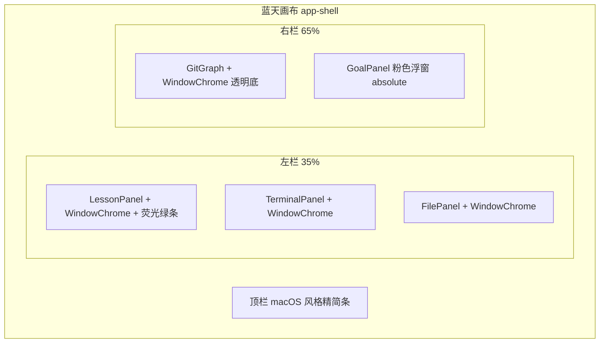

# Learn Git Branching 视觉换肤方案

## 设计方向

**风格定位**：playful desktop metaphor（LGB 的桌面窗口感），而非继续深色 git-sim nerd 风。

**保留不变**：Allotment 双栏比例、Lesson / Terminal / File 三叠结构、命令逻辑与 `LessonPanel` 反馈区职责划分。

**核心视觉 token**（写入 [`src/index.css`](src/index.css)）：

| Token | 用途 | 参考值 |
|-------|------|--------|
| `--canvas-blue` | 全页蓝天背景 | `#8fd3f4` |
| `--window-chrome` | 窗口标题栏 | `#e8e8e8` |
| `--panel-dark` | 终端/内容区深灰 | `#3a3a3a` |
| `--lime-bar` | 关卡操作条 | `#c8e600` |
| `--goal-pink` | 目标浮窗背景 | `#ff6eb4` |
| `--graph-node` | 提交节点 | 白底 + `#1a1a1a` 描边 |
| `--graph-edge` | 父子箭头 | `#1a1a1a` |
| `--branch-active` | 当前分支标签 | `#5ce1e6` |

字体（[`index.html`](index.html) 引入 Google Fonts）：
- UI：`Rubik`（圆润、偏教学玩具感，替换当前 Inter）
- 终端：保留 `JetBrains Mono`



---

## 1. 共享窗口装饰：`WindowChrome`

新建 [`src/components/WindowChrome.tsx`](src/components/WindowChrome.tsx)：

- 顶部灰白标题栏：左侧三色圆点（纯 CSS，无交互）、中间标题文字、可选右侧插槽
- 内容区 slot 包裹子组件
- Props：`title`, `children`, `variant?: 'dark' | 'light'`（终端用 dark，课程/文件用 light 内容底）

各面板改为：

```tsx
<WindowChrome title="学习 Git 分支" variant="dark">
  <TerminalPanel ... />
</WindowChrome>
```

**注意**：`TerminalPanel` 当前 `ref={hostRef}` 挂在 `<section>` 上，需把 `hostRef` 移到 WindowChrome 内的内容容器，避免 xterm 挂载到标题栏。

---

## 2. 课程区荧光绿关卡条

改 [`src/components/LessonPanel.tsx`](src/components/LessonPanel.tsx) + [`src/App.css`](src/App.css)：

- 在 `WindowChrome` 标题下方增加 **lime action bar**（对齐 LGB 截图）：
  - 左：当前关卡名 + 闪电图标（inline SVG）
  - 右：`提示` 按钮（调用 App 传入的 `onHint`，等效终端 `hint`）
- 原 `lesson-header` / `badge` 信息并入绿条或紧接其下
- `world-switch` 按钮改为 LGB 式扁平文字按钮（深字 + 轻阴影），去掉当前深色卡片边框感

App 侧在 [`src/App.tsx`](src/App.tsx) 增加：

```ts
const showHint = () => setLessonFeedback([`提示：${currentStep.commandHint}`]);
```

并传给 `LessonPanel`。

---

## 3. 简化粉色「目标」浮窗

新建 [`src/components/GoalPanel.tsx`](src/components/GoalPanel.tsx)：

- 绝对定位在右栏 Graph 区域右上角（`position: relative` 容器 + `absolute` 浮窗）
- 粉色背景 + 小号 `WindowChrome` 标题「目标」
- 内容：当前 `step.title`、`step.instruction`、`step.commandHint`（纯文字，不渲染目标 Git 图）
- 顶栏或绿条提供「隐藏目标」切换（`useState` 存在 App，默认显示）
- 小字提示：「也可在终端输入 hint」

Props：`step`, `visible`, `onToggleVisible`。

---

## 4. Git 图 LGB 风格重绘

改 [`src/components/GitGraph.tsx`](src/components/GitGraph.tsx)：

| 元素 | 现状 | 改为 |
|------|------|------|
| 面板背景 | 深蓝 `#0b1220` | 透明或浅蓝，让蓝天画布透出 |
| 提交节点 | 蓝色实心圆 | 白圆 + 黑描边，内文 `C0/C1/...` 序号（按 timestamp 排序编号） |
| 边 | 灰色贝塞尔 | 黑色直线/轻弯箭头（`marker-end`） |
| 分支标签 | 绿色 rect | 圆角 pill + 当前 HEAD 加 `*` 后缀 + 小三角指向节点 |
| 空状态 | 深色卡片 | 浅色描边提示框，文字深色，适配蓝天背景 |

[`src/viz/layout.ts`](src/viz/layout.ts) 仅需在 layout 结果中附带 `commitIndex` 或在 GitGraph 内按顺序生成 `C{n}` 标签，无需改引擎。

---

## 5. 终端与文件区

[`src/components/TerminalPanel.tsx`](src/components/TerminalPanel.tsx) xterm theme：

```ts
background: "#3a3a3a",
foreground: "#f0f0f0",
cursor: "#c8e600",
```

Prompt 前缀由 `git-learn$` 改为 `$`（更接近 LGB；仅显示层，不影响命令解析）。

[`src/components/FilePanel.tsx`](src/components/FilePanel.tsx)：套 `WindowChrome title="文件状态"`，内容区浅灰底 + 等宽字体列表。

---

## 6. 顶栏与全局样式

[`src/App.tsx`](src/App.tsx) + [`src/App.css`](src/App.css)：

- `app-shell` 背景改为纯色 `--canvas-blue`，去掉现有深色 radial gradient
- `topbar` 改为浅色浮窗条（圆角 + 阴影），按钮样式对齐 LGB 底部 dock 的扁平链接感
- `.card` 统一：白/浅灰外框 + `box-shadow: 0 8px 24px rgba(0,0,0,.18)` + `border-radius: 10px`
- Allotment 分隔条颜色调浅，避免破坏蓝天整体感

[`src/index.css`](src/index.css)：`color-scheme: light`（整体从 dark 切到 light canvas）。

---

## 7. 不动 / 延后

- **不做**：课程+终端合并、底部浮动 dock 取代顶栏、目标 Git 图、undo/solution 新功能
- **不动**：引擎、`terminalHistory` 逻辑、关卡数据结构（除新增 `onHint` 回调外）

---

## 验证方式

1. `npm run build` 通过
2. 目视检查：蓝天背景、四窗口 chrome、绿条、粉目标窗、白节点 Graph
3. Playwright 快测：终端输入 `git init` 后 Graph 节点为白圆；切关后样式不崩、Goal 文案随 step 更新
