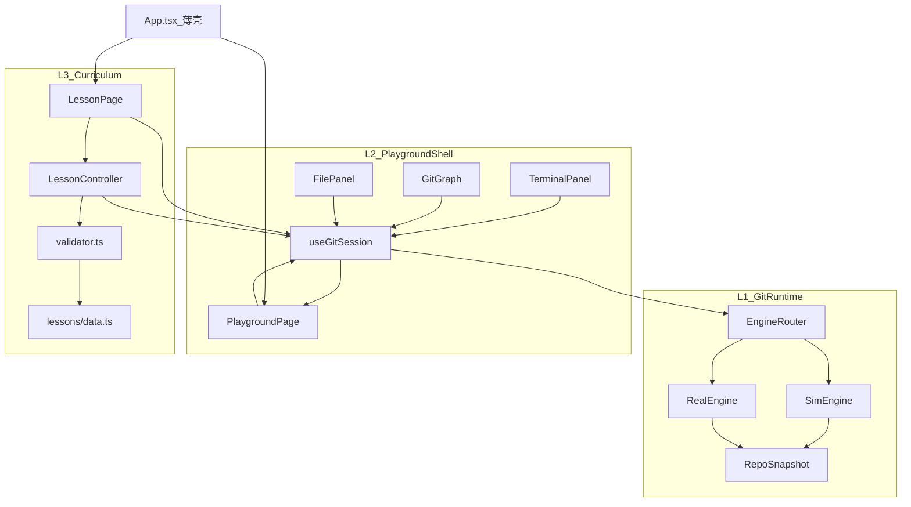
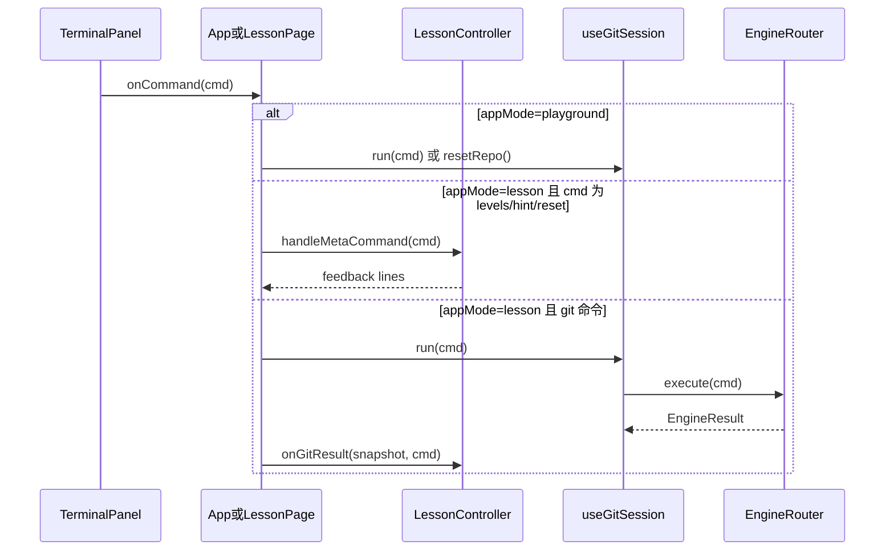
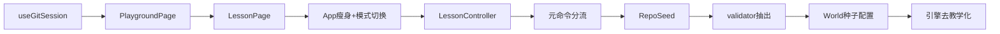

# 先沙盒后教程：重构方案

## 现状诊断

当前 [`src/App.tsx`](src/App.tsx) 同时承担引擎调用、课程验证、布局、主题与音效，是典型的「上帝组件」。核心耦合点与文档描述一致：

```103:141:src/App.tsx
  const onCommand = async (command: string) => {
    playTick();
    if (command === "levels") { /* 课程元命令 */ }
    if (command === "hint") { /* 课程元命令 */ }
    if (command === "reset") { /* 重置仓库 + 重置步骤 */ }

    const result = await router.execute(command);
    setSnapshot(result.snapshot);
    setTerminalHistory((prev) => [...prev, `$ ${command}`, ...result.output]);
    if (currentStep.validate(result.snapshot, command)) { /* 推进关卡 */ }
    // ...
  };
```

```68:81:src/App.tsx
  useEffect(() => {
    const mode = currentWorld.mode as EngineMode;
    router.setMode(mode);
    router.reset().then(setSnapshot);  // 切关无条件清空仓库
    // ...
  }, [worldIndex]);
```

引擎层 [`RepoSnapshot`](src/engine/snapshot.ts) 含 `stashCount`、`upstreamSet`、`hasGitignore`，被 [`lessons/data.ts`](src/lessons/data.ts) 的 inline `validate` 直接读取，导致 Sim 引擎为过关而扩展字段，而非按 Git 能力表建模。

**项目阶段定位（文档第 3 章）：** P0 后半 + P3 未做 + P4 先行（13 个 World 已写，平台层未独立）。

---

## 目标架构



**依赖方向（硬性约束）：** `L3 → L2 → L1`，禁止 `engine/*` import `lessons/*`。

---

## 目标目录结构

在现有 [`src/`](src/) 基础上增量新增，不推倒重来：

```
src/
├── App.tsx                      # 薄壳：模式切换、顶栏、主题、音效
├── app/
│   └── AppShell.tsx             # Allotment 布局骨架（从 App 抽出）
├── hooks/
│   └── useGitSession.ts         # L2 会话：snapshot / history / run / resetRepo
├── playground/
│   └── PlaygroundPage.tsx       # L2 自由沙盒（默认首页，无课程 UI）
├── lesson/
│   ├── LessonPage.tsx           # L3：Playground + LessonPanel + GoalPanel
│   ├── controller.ts            # L3：元命令、步骤推进、World 切换
│   └── validator.ts             # L3：从 data.ts 迁出的纯验证函数
├── engine/                      # L1 保留，后续扩展 RepoSeed
├── components/                  # L2 通用 UI 不动；L3 组件仅 LessonPage 引用
├── lessons/
│   ├── data.ts                  # 纯数据（逐步去掉 inline validate）
│   ├── types.ts                 # 扩展 RepoSeed、validatorId 字段
│   └── helpers.ts               # 保留，validator.ts 复用
└── viz/                         # L2 不动
```

---

## 分阶段实施路线

### 阶段 A：P0 入口 — 拆上帝组件（约 2 天，最高 ROI）

**目标：** 不改课程内容，立刻让「沙盒」在概念和 UI 上独立。

#### A1. 新建 `useGitSession`

从 App 抽出会话状态，封装对 [`EngineRouter`](src/engine/router.ts) 的调用：

```ts
// src/hooks/useGitSession.ts（目标契约）
interface GitSession {
  snapshot: RepoSnapshot;
  history: string[];
  mode: EngineMode;
  run(command: string): Promise<EngineResult>;   // 只调引擎 + 追加历史
  resetRepo(): Promise<void>;                    // 只清仓库，不动课程
  setMode(mode: EngineMode): void;
  getCompletions(input: string): string[];
}
```

- `router` 实例从 App 模块级单例迁入 hook 内部或 `engine/session.ts` 工厂
- `run()` 只处理 `git *` 命令，**不**拦截 `levels` / `hint` / `reset`
- `resetRepo()` 对应沙盒「重置仓库」按钮，不重置 `stepIndex`

#### A2. 新建 `PlaygroundPage`

组合现有 L2 组件，无课程 UI：

| 区域 | 组件 | 行为 |
|------|------|------|
| 左栏 | `TerminalPanel` + `FilePanel` | `onCommand` 直接调 `session.run()` |
| 右栏 | `GitGraph` | 读 `session.snapshot` |
| 顶栏操作 | 重置仓库、引擎模式切换（sim/real） | 调 `session.resetRepo()` / `setMode()` |

#### A3. 新建 `LessonPage`

- 内部渲染 `PlaygroundPage` 的布局（或抽取共享 `PlaygroundLayout` 组件避免重复）
- 叠加 `LessonPanel`、`GoalPanel`、上一关/下一关按钮
- 命令入口改为：`LessonController.handleCommand(cmd)` → 内部再调 `session.run()`

#### A4. 瘦身 `App.tsx`

保留职责：
- `appMode: "playground" | "lesson"` 状态（首版用 state，**不引入** react-router）
- 顶栏切换「自由沙盒 | 课程模式」，**默认 playground**
- 主题（`darkMode`）、音效（`playTick`）、localStorage 读写
- 按 `appMode` 渲染 `PlaygroundPage` 或 `LessonPage`

**验收（P0）：**
- 隐藏课程 UI 后网站仍是完整可用产品
- 可连续执行 init → add → commit → branch → checkout → merge
- Graph 与 FilePanel 每次命令后同步更新
- 沙盒模式 `reset` 只清仓库，不影响任何课程进度

---

### 阶段 B：P3 教程插件化（约 2 天）

#### B1. 新建 `LessonController`

```ts
// src/lesson/controller.ts
type StepResult = "advance" | "stay" | "complete";

class LessonController {
  worldIndex: number;
  stepIndex: number;
  feedback: string[];

  handleMetaCommand(cmd: "levels" | "hint" | "reset"): string[] | "reset-repo";
  onGitResult(snapshot: RepoSnapshot, command: string): StepResult;
  selectWorld(index: number): Promise<void>;  // 加载 seed，非盲目 reset
  resetLesson(): Promise<void>;               // 课程 reset：seed + stepIndex=0
}
```

从 App 迁入的逻辑：
- `levels` / `hint` 响应（**仅在课程模式**由 Terminal 路由到 controller）
- `currentStep.validate` 调用与步骤推进
- `lessonFeedback` 状态管理
- `localStorage` 进度读写（`git-learn-progress`）

#### B2. 元命令路由分流



- 沙盒模式：`getCompletions` 不含 `levels` / `hint`（或保留 `reset` 作为仓库重置别名）
- 课程模式：补全列表含元命令

#### B3. World 切换改用 RepoSeed（消除无条件 reset）

当前 `reset()` 一律回到空仓库。需新增：

1. **`RepoSeed` 类型**（`src/engine/seed.ts` 或 `snapshot.ts`）— 描述预设场景（已有 init+commit、多分支、含 remote 等）
2. **扩展 `GitEngine.reset(seed?: RepoSeed)`** — SimEngine 实现 `loadSeed()`，RealEngine 暂只支持空 seed
3. **每个 World 配置 `seedId` 或内联 seed** — 例如 World 6 直接进入「已有 main + feature 分支」场景，而非从 `git init` 重来
4. `selectWorld()` 流程：`setMode(world.mode)` → `resetRepo(world.seed)` → 追加终端分隔行（保留现有历史追加行为）

**验收（P3）：**
- 顶栏可切换沙盒/课程，默认沙盒
- 切关加载对应 seed，终端历史保留
- `levels` / `hint` 仅课程模式响应

---

### 阶段 C：P4 验证器与数据分离（约 2–3 天，可渐进）

#### C1. 抽出 `validator.ts`

将 [`lessons/data.ts`](src/lessons/data.ts) 中 13 个 World 的全部 inline `validate` 函数迁至 `src/lesson/validator.ts`，按 step `id` 注册：

```ts
// lessons/types.ts 变更
export interface LessonStep {
  // validate 改为可选 validatorId
  validatorId: string;  // 如 "w1-init"
}

// validator.ts
const validators: Record<string, (s: RepoSnapshot, cmd: string) => boolean> = {
  "w1-init": (s, cmd) => s.initialized && cmdIs("git init")(cmd),
  // ...
};
```

`data.ts` 只保留标题、说明、commandHint、riskNote、`validatorId`、`mode`。

#### C2. 为 World 补充 seed 配置

按关卡主题定义最小 seed 集（建议 5–8 个复用场景）：

| seedId | 场景 | 适用 World |
|--------|------|-----------|
| `empty` | 未 init，有 untracked 文件 | W1 |
| `initialized-no-commit` | 已 init | W2 前半 |
| `main-with-commit` | main 上 1 个 commit | W2–W5 |
| `with-remote` | 含 origin remote | W3, W12 |
| `two-branches` | main + feature | W6, W7 |
| `with-stash` | 已有 stash | W8 |
| `with-gitignore` | 含 .gitignore | W11 |

**验收（P4）：**
- `data.ts` 无 inline 函数
- 每 World 有明确初始场景
- 现有 13 关行为与迁移前一致（回归手动走一遍）

---

### 阶段 D：P1 引擎去教学化（持续，与 A–C 并行但低优先级）

不在 P0–P3 阻塞，按文档「暂缓为单一关卡加命令」原则推进：

1. **审计 `RepoSnapshot` 教学字段**

| 字段 | 现状 | 建议 |
|------|------|------|
| `stashCount` | Sim 有真实 stash 模型 | **保留**，属 Git 可观测状态 |
| `hasGitignore` | 可由 `files` 推导 | validator 改为 `files.includes(".gitignore")`，逐步从 snapshot 移除 |
| `upstreamSet` | Sim 内部布尔 | validator 改为检查 `refs` 中 `origin/main` 等跟踪关系，逐步移除 |

2. **冻结 `GitEngine` 接口 2 周**，新命令只来自「命令能力表」文档（建议新建 `docs/git-command-matrix.md`）

3. **Real 引擎**：保持精简；课程步骤继续显式标注 `mode: "sim" | "real"`

---

## 关键文件迁移对照

| 现状 | 迁移动作 | 目标归属 |
|------|----------|----------|
| `App.tsx` L22–25 snapshot/history | 搬到 `useGitSession` | L2 |
| `App.tsx` onCommand git 分支 | 搬到 `useGitSession.run()` | L2 |
| `App.tsx` onCommand levels/hint/reset | 搬到 `LessonController` | L3 |
| `App.tsx` validate 推进 | 搬到 `LessonController.onGitResult` | L3 |
| `App.tsx` worldIndex effect reset | 改为 `controller.selectWorld` + seed | L3 |
| `App.tsx` Allotment 布局 | 抽到 `AppShell` 或 `PlaygroundLayout` | L2 |
| `App.tsx` 顶栏主题/音效 | 保留在 `App.tsx` | 壳 |
| `lessons/data.ts` validate | 迁到 `validator.ts` | L3 |
| `engine/router.ts` reset() | 扩展 `reset(seed?)` | L1 |
| `components/*` | 基本不动 | L2/L3 |

---

## 风险与约束

- **不引入 react-router**（首版）：文档建议用 `appMode` state 即可，减少依赖与迁移面
- **不新增 World、不为单关扩展 Sim 命令**（P0–P3 期间冻结）
- **不做目标图自动对比**（LGB 粉窗 L-3 验证，明确暂缓）
- **Real 模式**：沙盒可切换，但课程仍按 World 标注 mode；避免新手关在 real 下遇到 unsupported 命令
- **回归方式**：`npm run build` 通过 + 手动验收 P0/P3 检查清单；现有无自动化测试，可选后续用 Playwright 补沙盒 smoke test

---

## 推荐执行顺序（单线程）



**第一步代码任务（可立即开工）：**

1. `src/hooks/useGitSession.ts` — 0.5d
2. `src/playground/PlaygroundPage.tsx` — 0.5d
3. `src/lesson/LessonPage.tsx` — 0.5d
4. `src/App.tsx` 改为模式切换薄壳 — 0.5d
5. 顶栏「沙盒 / 课程」切换 — 0.25d

完成 Step 1–3 后，再写新 World、新命令、新可视化都会与课程解耦，符合文档结语所述投入产出比。
