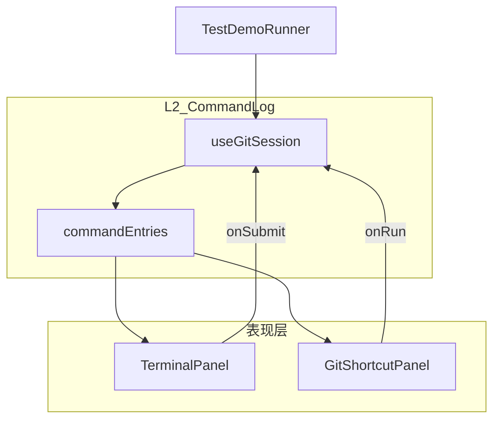

# 终端与快捷面板：统一数据层 + 双视图同步

## 问题与目标

用户已确认快捷按钮能触发教程，但还需：

1. **切换终端/快捷后历史不丢** — 快捷执行的命令在终端里仍可见，可继续输入
2. **快捷面板也有「记录区」** — 上方可滚动、逐行累积；按钮固定在底部
3. **按钮布局** — 按文本长度流式换行，非每按钮独占一行；点击后在**按钮右侧**内联展开子选项
4. **统一配色** — 各 Git 子命令、`-m` 等 flag 在快捷按钮与终端高亮中颜色一致；历史记录行沿用同色
5. **测试演示** — 顶栏加「测试」按钮，约 1 秒一条自动执行常用命令组合；终端与快捷记录同步增长
6. **架构** — 终端与快捷仅为表现层，逻辑与数据共用

## 现状简要

- [`useGitSession.run()`](src/hooks/useGitSession.ts) 已写入 `history: string[]`（`$ cmd` + output）
- 快捷面板 [`GitShortcutPanel`](src/components/GitShortcutPanel.tsx) 走同一 `onCommand` → `session.run()`，**数据已共享**
- 切换模式时 [`TerminalPanel`](src/components/TerminalPanel.tsx) 会卸载重建；`history` prop 应能重放，但缺少结构化元数据（来源、子命令 id），快捷侧也无历史 UI
- 配色分散在 [`highlight.ts`](src/terminal/highlight.ts)（ANSI）与 [`App.css`](src/App.css)（快捷 chip 统一黄绿色）



---

## 阶段 1：统一命令日志（数据层）

### 新建 [`src/terminal/commandLog.ts`](src/terminal/commandLog.ts)

```ts
export type CommandSource = "terminal" | "shortcut" | "test";

export interface CommandLogEntry {
  id: string;
  command: string;
  source: CommandSource;
  shortcutId?: string;   // 对应 shortcuts.ts 的 id，用于配色
  output: string[];
  timestamp: number;
}

export function flattenEntry(entry: CommandLogEntry): string[] {
  return [`$ ${entry.command}`, ...entry.output];
}
```

### 扩展 [`useGitSession`](src/hooks/useGitSession.ts)

- 新增状态 `entries: CommandLogEntry[]`
- `history` 改为 **派生**：`entries.flatMap(flattenEntry)`（或同步维护，对外 API 保持 `history: string[]` 不变）
- 统一入口 `runCommand(command, meta?: { source; shortcutId })`：
  - 调引擎 `execute`
  - 追加一条 `CommandLogEntry`
  - 更新 `snapshot`
- `appendHistory(lines)` 保留，用于系统行（引擎切换等），可记为 `source: "system"` 或继续只追加到 `history` 扁平列表（终端仍显示，快捷记录区可过滤只显示 git 命令）

### 调整调用方

- [`PlaygroundPage`](src/playground/PlaygroundPage.tsx) / [`LessonPage`](src/lesson/LessonPage.tsx)：`onCommand` 统一调 `session.runCommand(cmd, { source })`
- [`GitShortcutPanel`](src/components/GitShortcutPanel.tsx)：执行时传 `source: "shortcut", shortcutId`

---

## 阶段 2：统一 Git 配色表

### 新建 [`src/terminal/gitColors.ts`](src/terminal/gitColors.ts)

为常用子命令分配固定色（示例）：

| 命令 id | 用途 | CSS 变量 / 类 |
|---------|------|----------------|
| init | 初始化 | `--git-init` |
| add | 暂存 | `--git-add` |
| commit | 提交 | `--git-commit` |
| branch/checkout/switch | 分支 | `--git-branch` |
| merge/rebase | 合并变基 | `--git-merge` |
| stash | 暂存栈 | `--git-stash` |
| push/pull/fetch/remote | 远程 | `--git-remote` |
| log | 历史 | `--git-log` |
| reset/restore | 撤销 | `--git-reset` |
| flag | `-m` `--oneline` 等 | `--git-flag` |
| string | 引号参数 | `--git-string` |
| git | 关键字 git | `--git-keyword` |

导出：

- `getSubcommandId(command: string): string | null` — 从完整命令解析子命令
- `getAnsiColor(subcommandId, tokenKind)` — 供终端
- `getColorClass(subcommandId, tokenKind)` — 供快捷 UI / 历史行

### 重构 [`highlight.ts`](src/terminal/highlight.ts)

- `highlightGitTokens` 改为读取 `gitColors.ts`，子命令色与 flag/字符串色与快捷面板一致
- 不再对所有子命令统一青色

### 更新 [`App.css`](src/App.css)

- 在 `:root` / `[data-theme="dark"]` 定义 `--git-*` 变量
- `.git-shortcut-main--{id}`、`.shortcut-chip--flag`、`.command-log-line--{id}` 使用对应变量

---

## 阶段 3：快捷面板 UI 重构

### 布局（[`GitShortcutPanel.tsx`](src/components/GitShortcutPanel.tsx)）

```
┌──────────────────────────────┐
│ .shortcut-log (flex:1, scroll)│  ← 读取 session.entries
│   每条：彩色命令行 + 可选输出  │
├──────────────────────────────┤
│ .shortcut-toolbar (wrap)      │  ← 固定底部，flex-wrap
│ [init][status][add][-m][.][…] │
└──────────────────────────────┘
```

- `PlaygroundLayout` 向 `GitShortcutPanel` 传入 `entries`（或整个 `session`）
- 历史区 `overflow-y: auto`，新条目自动滚到底（`useEffect` + `scrollIntoView`）
- 每条记录用 [`CommandLogLine`](src/components/CommandLogLine.tsx) 组件渲染 token 级配色（复用 `gitColors` 解析逻辑，输出 DOM 而非 ANSI）

### 按钮栏改造

- 容器 `display: flex; flex-wrap: wrap; gap: 6px` — **不再**每个按钮 `width: 100%`
- 展开逻辑：点击主按钮后，**在同一 flex 流中**紧跟渲染 option chips（移除独立 `.git-shortcut-options` 块级 div）
- 主按钮按 `shortcut.id` 上色；chip 中 `-m`/`--oneline` 等用 `--git-flag` 色

### 切换模式不丢记录

- 终端继续消费 `history`（由 entries 派生）
- 修复 [`TerminalPanel`](src/components/TerminalPanel.tsx) 重挂载时全量回放：在 init effect 末尾若 `history.length > 0`，同步打印已有历史（避免与 history effect 竞态漏打）

---

## 阶段 4：测试演示按钮

### 新建 [`src/terminal/testCommands.ts`](src/terminal/testCommands.ts)

预置演示序列（约 15–20 条，覆盖 init → add → commit → branch → log 等）：

```ts
export const demoCommandSequence: Array<{
  command: string;
  shortcutId?: string;
  delayMs?: number;
}> = [
  { command: "git init", shortcutId: "init" },
  { command: "git add .", shortcutId: "add" },
  { command: 'git commit -m "demo commit"', shortcutId: "commit" },
  // ...
];
```

### 新建 [`src/hooks/useCommandDemo.ts`](src/hooks/useCommandDemo.ts)

- `runDemo(session)`：先 `resetRepo()`，再按 `delayMs`（默认 1000）逐条 `runCommand(cmd, { source: "test", shortcutId })`
- `isRunning` 状态 + `cancelDemo()`（组件卸载或再次点击时中断）

### [`App.tsx`](src/App.tsx) 顶栏

在「自由沙盒 / 课程模式」旁增加 **测试** 按钮：

- 点击开始演示；运行中显示「测试中…」并 disabled
- 演示期间终端/快捷切换均能看到记录同步增长（同一 `entries`）

---

## 阶段 5：接线与清理

| 文件 | 改动 |
|------|------|
| [`useGitSession.ts`](src/hooks/useGitSession.ts) | entries + runCommand |
| [`commandLog.ts`](src/terminal/commandLog.ts) | 类型与 flatten |
| [`gitColors.ts`](src/terminal/gitColors.ts) | 配色单一来源 |
| [`highlight.ts`](src/terminal/highlight.ts) | 接入 gitColors |
| [`GitShortcutPanel.tsx`](src/components/GitShortcutPanel.tsx) | 历史区 + 流式按钮 + 配色 |
| [`CommandLogLine.tsx`](src/components/CommandLogLine.tsx) | **新建** DOM 侧 token 渲染 |
| [`PlaygroundLayout.tsx`](src/playground/PlaygroundLayout.tsx) | 传 entries 给快捷面板 |
| [`TerminalPanel.tsx`](src/components/TerminalPanel.tsx) | 挂载时回放 history |
| [`testCommands.ts`](src/terminal/testCommands.ts) | 演示序列 |
| [`useCommandDemo.ts`](src/hooks/useCommandDemo.ts) | 演示 runner |
| [`App.tsx`](src/App.tsx) | 测试按钮 |
| [`App.css`](src/App.css) | 新布局与配色变量 |

---

## 验收标准

- 快捷执行 `git commit -m "x"` 后切到终端，能看到 `$ git commit -m "x"` 及输出，可继续敲命令
- 快捷面板上方记录区逐行累积、可滚动；按钮在底部流式排列
- 点击 `commit` 后 `-m` chip 紧跟在按钮右侧出现（非换行独占一块）
- `commit` / `add` / `-m` 在快捷按钮、快捷记录、终端高亮中颜色一致
- 顶栏「测试」每秒追加一条命令，终端与快捷记录同步更新
- 课程模式下快捷命令仍触发关卡验证
- `npm run build` 通过

---

## 预估工作量

约 1–1.5 天：数据层 0.25d + 配色统一 0.25d + 快捷 UI 0.5d + 测试演示 0.25d + 联调 0.25d
