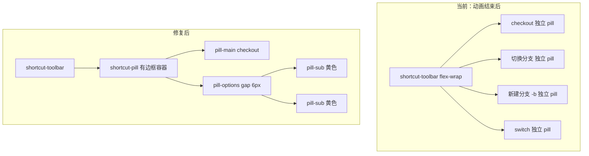

# 子按钮层级与配色修复

## 问题根因

上次实现按「展开后拆成独立 pill」方案，在 [`src/App.css`](src/App.css) 中做了：

```748:761:src/App.css
.shortcut-pill.is-expanded {
  align-items: center;
  gap: 6px;
  overflow: visible;
  border: none;           /* 去掉外层分组 */
  background: transparent;
  box-shadow: none;
}
.shortcut-pill.is-expanded .pill-main {
  border: 1px solid ...;  /* 主按钮变成独立 pill */
  ...
}
```

这导致动画结束后：
- 外层 `.shortcut-pill` 无边框/背景，整组在工具栏里**视觉上解体**
- `checkout` 主按钮与子按钮「切换分支」「新建分支 -b」各自像一级按钮，与 `switch` 同级排列（见用户截图）
- 子按钮继承 `--git-branch` 青色，与父按钮同色，无法区分层级

动画过程中看起来「正确」，是因为 `.pill-options` 仍在 `max-width` 过渡、`overflow: hidden` 裁切，子按钮尚未完全「弹出」为独立视觉单元。



## 修复方案

仅改 [`src/App.css`](src/App.css)，不改 [`src/components/ShortcutDock.tsx`](src/components/ShortcutDock.tsx)。

### 1. 恢复展开态分组容器

**删除** `.shortcut-pill.is-expanded` 的 `border: none; background: transparent; box-shadow: none`。

**改为**保留与未展开一致的外壳，并增加内边距与间距：

```css
.shortcut-pill.is-expanded {
  align-items: center;
  gap: 6px;
  padding-right: 6px;      /* 子按钮区右侧留白 */
  overflow: hidden;        /* 恢复裁切，保持一体感 */
  flex-wrap: nowrap;       /* 组内不换行 */
}
```

**删除** `.shortcut-pill.is-expanded .pill-main` 的独立边框/背景规则，展开后主按钮回到「容器内透明」状态（与未展开一致）。

### 2. 子按钮保留小 pill 样式，但置于组内

保留上次正确的尺寸与间距改动：
- `.pill-options { gap: 6px; align-items: center; }`
- `.pill-sub { font-size: 11px; padding: 4px 8px; border-radius: 6px; background: rgba(255,255,255,0.06); }`
- 收起态 `padding: 4px 0`、展开动画 `max-width` + `--delay` 不变

补充覆盖全局 `button` 样式，确保高度始终小于主按钮：

```css
.pill-main,
.pill-sub {
  font-weight: 400;   /* 覆盖 button { font-weight: 500 } */
}
```

### 3. 子按钮配色改为 `--git-flag` 黄色

按用户选择，子按钮不再继承命令色。在 `.pill-sub` 基础样式中设置：

```css
.pill-sub {
  color: var(--git-flag);
  border: 1px solid color-mix(in srgb, var(--git-flag) 45%, transparent);
}
```

**移除** 829–867 行各 `.shortcut-pill--{id} .pill-sub` 的命令色/边框色覆盖（`add`、`commit`、`branch`、`checkout` 等），避免与 flag 色冲突。

父级 `.pill-main` 和 `.shortcut-pill--{id}` 容器边框仍保持各命令主题色。

### 4. 微调 `.pill-options` 展开宽度

分组后子按钮在容器内排列，`max-width: 520px` 可保留；若动画末尾仍有裁切，可增至 `560px`。

`.shortcut-pill.is-expanded .pill-options` 的 `overflow` 改回 `hidden`，与容器一致。

### 5. 主按钮与子选项区视觉分隔（可选轻量）

在 `.pill-options` 上加 `padding-left: 6px` 或 `margin-left: 6px`，与主按钮 label 区隔开（组内 gap，不影响工具栏一级间距）。

## 预期效果

| 元素 | 展开后外观 |
|------|-----------|
| 外层 `.shortcut-pill` | 保留命令色边框 + 深色背景，整组是一个单元 |
| `.pill-main` | 命令色文字，透明底，与未展开一致 |
| `.pill-sub` | 更小 pill、`--git-flag` 黄字黄框、同背景，组内 `gap: 6px` |
| 工具栏其他按钮 | 与展开组之间仍隔 `6px`，子按钮不会插入 `checkout` 与 `switch` 之间 |

## 验证清单

1. 点击 `checkout` 展开，动画结束后「切换分支」「新建分支 -b」仍在 checkout 青色边框容器内
2. 子按钮高度明显低于主按钮，黄色边框/文字
3. `branch`、`add`、`commit` 等同理
4. 收起动画流畅，无圆角裁切异常
5. `npm run build` 通过
