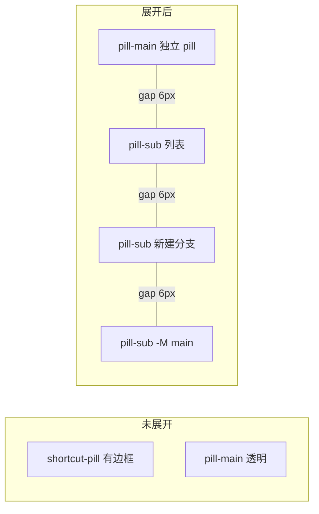

# 快捷坞子按钮样式对齐

## 现状

子按钮样式定义在 [`src/App.css`](src/App.css) 的 `.pill-sub` 区块（约 769–793 行）：

- 背景：`color-mix(..., var(--git-flag) 25%, ...)` → 黄褐色块
- 文字：`var(--git-flag)` 黄色
- 布局：`border-left` 拼接、无间距、`overflow: hidden` 裁切圆角
- 一级按钮间距：`.shortcut-toolbar { gap: 6px }`（725 行）

一级 pill 外观（731–738 行）：

```css
border: 1px solid rgba(255, 255, 255, 0.14); /* 各命令有 --init/--branch 等覆盖 */
background: rgba(255, 255, 255, 0.06);
border-radius: 8px;
```

颜色仅作用于 `.pill-main`（799–821 行），子按钮未继承命令色。

组件结构在 [`src/components/ShortcutDock.tsx`](src/components/ShortcutDock.tsx)，**无需改逻辑**，仅 CSS 调整即可。

## 目标效果

| 属性 | 一级 pill（init/status） | 子按钮（展开后） |
|------|--------------------------|------------------|
| 背景 | `rgba(255,255,255,0.06)` | 相同 |
| 边框/文字 | 命令主题色（如 branch 青色） | 继承父级 `--branch` 等同色 |
| 字号/内边距 | `12px / 6px 10px` | 略小：`11px / 4px 8px` |
| 圆角 | `8px`（容器） | `6px`（略小） |
| 间距 | 工具栏 `gap: 6px` | 子按钮之间 `gap: 6px`；主按钮与子按钮之间 `gap: 6px` |

## 实现方案

### 1. 展开态布局：主按钮 + 子按钮均为独立 pill

展开时（`.shortcut-pill.is-expanded`）：

- 去掉外层统一边框/背景/`overflow: hidden`，改为 `display: inline-flex; align-items: center; gap: 6px; background: transparent; border: none; box-shadow: none; overflow: visible`
- `.pill-main` 在展开态获得与未展开容器相同的外观（边框、背景、圆角），使主按钮视觉上仍是独立 pill
- 未展开态保持现有「容器包一层 + 透明 main」行为不变



### 2. 重写 `.pill-sub` 基础样式

在 [`src/App.css`](src/App.css) 修改：

- **移除**：`border-left` 拼接、`var(--git-flag)` 黄底黄字
- **新增**：
  - `border: 1px solid rgba(255, 255, 255, 0.14)`（由命令色规则覆盖）
  - `background: rgba(255, 255, 255, 0.06)`
  - `border-radius: 6px`
  - `font-size: 11px; padding: 4px 8px`（比 main 矮一号）
  - 覆盖全局 `button:hover` 的 `transform/box-shadow`（避免子按钮 hover 跳动过大），可用 `.pill-sub:hover { transform: none; box-shadow: none; }` 或轻微边框变亮

### 3. `.pill-options` 加间距

```css
.pill-options {
  display: flex;
  align-items: center;
  gap: 6px;  /* 与 .shortcut-toolbar 一致 */
}
```

展开时 `.pill-options` 的 `max-width` 需略增（当前 480px），以容纳 `(子按钮宽度 + 6px gap) × N`；按最长文案「新建分支」估算，增至约 `520px` 即可。

### 4. 命令色扩展到子按钮

在现有 799–821 行颜色规则中，为每个 `.shortcut-pill--{id}` 补充 `.pill-sub` 选择器，例如：

```css
.shortcut-pill--branch .pill-main,
.shortcut-pill--branch .pill-sub { color: var(--git-branch); }
.shortcut-pill--branch .pill-sub {
  border-color: color-mix(in srgb, var(--git-branch) 45%, transparent);
}
```

覆盖所有有 `options` 的命令：`add`、`commit`、`branch`、`checkout`、`switch`、`merge`、`stash`、`log`、`push`、`pull`、`remote`、`reset`、`restore` 等（与 [`src/terminal/shortcuts.ts`](src/terminal/shortcuts.ts) 中带 `options` 的 id 对齐）。

### 5. 保留展开动画

继续使用 `max-width` + `opacity` + `--delay` 逐个出现逻辑（[`ShortcutDock.tsx`](src/components/ShortcutDock.tsx) 第 70 行），仅调整：

- 收起态 `.pill-sub` 的 `padding` 改为 `4px 0`（与展开态 `4px 8px` 动画一致）
- 确认 `gap: 6px` 在 `max-width: 0` 时不撑开布局（flex gap 对零宽元素无影响）

### 6. 展开态 `.pill-main` 样式补充

```css
.shortcut-pill.is-expanded .pill-main {
  border: 1px solid;           /* 颜色由 .shortcut-pill--{id} 继承 */
  border-radius: 8px;
  background: rgba(255, 255, 255, 0.06);
}
```

各命令的 `border-color` 已由 `.shortcut-pill--{id}` 定义，展开后 main 自动继承。

## 涉及文件

- **主要**：[`src/App.css`](src/App.css) — `.shortcut-pill`、`.pill-main`、`.pill-options`、`.pill-sub` 及命令色规则
- **不改**：[`src/components/ShortcutDock.tsx`](src/components/ShortcutDock.tsx)（除非实测动画需微调 `max-width` 常量）

## 验证方式

1. 打开终端快捷坞，点击 `branch` 展开
2. 确认「列表 / 新建分支 / -M main」为独立青色边框 pill，背景与 `init` 一致，高度略低于 `branch` 主按钮
3. 子按钮之间、主按钮与子按钮之间间距与 `init`↔`status` 相同
4. 同样检查 `add`、`commit`、`checkout` 等有子选项的命令
5. 收起/展开动画仍流畅，无裁切圆角、无布局跳动
