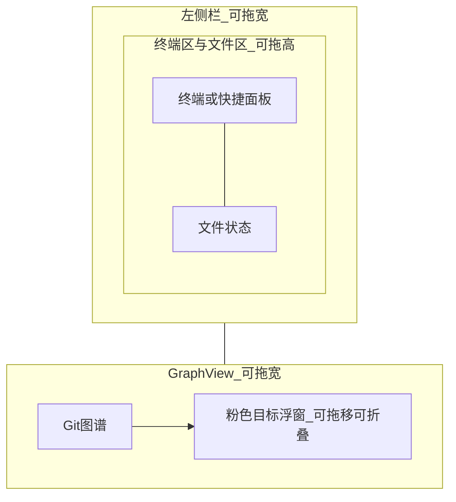
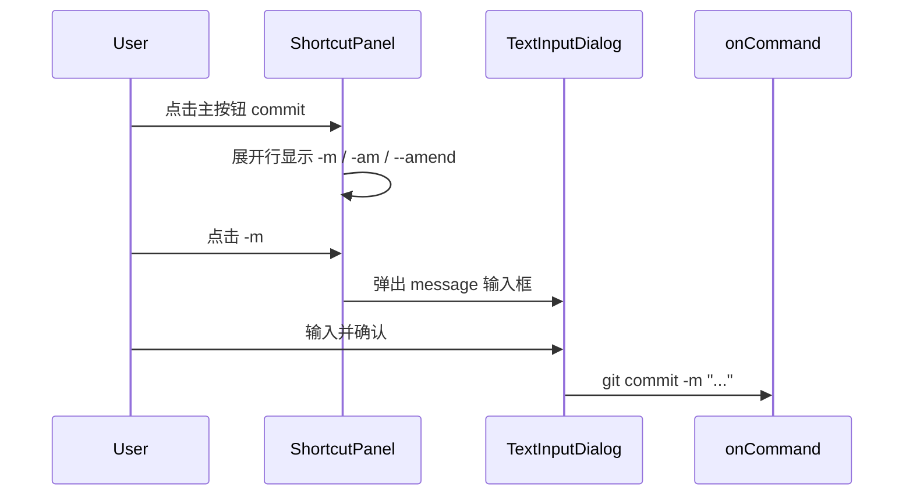

# 布局重组与 Git 快捷面板方案

## 目标效果（对照截图）



- **移除**左上角「学习 Git 分支」独立窗口
- **合并**其全部内容到右上角粉色「目标」浮窗
- **左侧**仅保留：终端（或快捷面板）+ 文件状态，中间可拖分隔条
- **左右**大栏继续用现有 Allotment 拖宽（已有，需保留并调样式）

---

## 阶段 1：左侧布局改为可拖分栏

### 现状

[`PlaygroundLayout.tsx`](src/playground/PlaygroundLayout.tsx) 左侧用 CSS Grid 固定比例：

```62:67:src/App.css
.left-stack {
  grid-template-rows: minmax(280px, 37%) minmax(210px, 1fr) minmax(170px, 26%);
}
```

课程模式下还多占一行 `leftTop`（LessonPanel）。

### 改动

重构 [`PlaygroundLayout.tsx`](src/playground/PlaygroundLayout.tsx)：

- **删除** `leftTop` 插槽与 `left-stack` grid
- 左侧 `Allotment.Pane` 内改为 **纵向嵌套 Allotment**：

```tsx
<Allotment vertical defaultSizes={[62, 38]} className="left-split">
  <Allotment.Pane minSize={160}>
    <WindowChrome title="终端" rightSlot={modeToggle}>...</WindowChrome>
  </Allotment.Pane>
  <Allotment.Pane minSize={120}>
    <WindowChrome title="文件状态">...</WindowChrome>
  </Allotment.Pane>
</Allotment>
```

- 外层横向 `Allotment`（左 35% / 右 65%）保持不变，分隔条样式沿用 `.split-view-sash`
- 可选：将 `defaultSizes` 写入 `localStorage`（`git-learn-layout`），刷新后恢复用户拖动的比例

---

## 阶段 2：课程内容并入可拖拽目标浮窗

### 合并内容

将 [`LessonPanel.tsx`](src/components/LessonPanel.tsx) 中的信息迁入增强版 [`GoalPanel.tsx`](src/components/GoalPanel.tsx)（或新建 `LessonGoalPanel.tsx` 再替换引用）：

| 原 LessonPanel 内容 | 迁入目标浮窗位置 |
|---------------------|------------------|
| World 标题 + SIM/REAL 标签 | 浮窗标题栏 |
| 关卡描述、Step 进度 | 粉色 body 顶部 |
| 当前步骤标题/说明/commandHint | body 中部（保留现有结构） |
| riskNote、feedback | body 底部 |
| 上一关/下一关、提示按钮 | 标题栏或 body 底栏 |
| 「隐藏目标」 | 改为「折叠」图标按钮 |

### 可拖拽 + 可折叠

新建通用组件 [`src/components/FloatingPanel.tsx`](src/components/FloatingPanel.tsx)：

- **拖拽**：标题栏 `pointerdown` 记录偏移，`document` 级 `mousemove/mouseup` 更新 `top/left`（相对于 `graph-pane-shell`）
- **折叠**：`collapsed` 状态只显示标题栏（约 30px 高），展开显示 body
- **边界约束**：拖放时 clamp 在 Graph 容器内
- **持久化**（可选）：`position` + `collapsed` 存 `localStorage`（`git-learn-goal-panel`）

[`LessonPage.tsx`](src/lesson/LessonPage.tsx) 调整：

- 移除 `leftTop={lessonPanel}` 与 `LessonPanel` + `lesson-window` 引用
- `rightOverlay` 传入完整课程 props 的 `LessonGoalPanel`
- 删除 `goalVisible` 隐藏逻辑，改为浮窗自身的折叠状态

沙盒模式（[`PlaygroundPage.tsx`](src/playground/PlaygroundPage.tsx)）不渲染该浮窗。

---

## 阶段 3：终端 ↔ 快捷按钮面板切换

### 模式切换入口

扩展 [`WindowChrome.tsx`](src/components/WindowChrome.tsx) 已有 `rightSlot`，在终端窗口标题栏放切换按钮：

- `终端` | `快捷` 分段切换（或图标 Tab）
- 状态 `panelMode: "terminal" | "shortcuts"` 放在 `PlaygroundLayout`（沙盒与课程共用）

### 新建 Git 快捷面板

[`src/components/GitShortcutPanel.tsx`](src/components/GitShortcutPanel.tsx) + 数据 [`src/terminal/shortcuts.ts`](src/terminal/shortcuts.ts)：

```ts
interface GitShortcut {
  id: string;
  label: string;           // 显示名，如「提交」
  prefix: string;          // 固定前缀，如 "git commit"
  options?: ShortcutOption[];  // 展开后的小按钮
}

interface ShortcutOption {
  id: string;
  label: string;           // 如 "-m"、"."、"main"
  suffix: string;          // 拼接到命令的片段
  input?: {                 // 需要弹窗填参
    placeholder: string;
    wrap?: (value: string) => string;  // 如 v => `"${v}"`
  };
}
```

**交互流程：**



- 主按钮网格：init / status / add / commit / branch / checkout / merge / stash / log / push / pull / reset 等（对齐 Sim 引擎已有命令）
- 同一时刻只展开一个主按钮行（点击另一个则切换）
- 子选项为 **单选** chip（互斥 flag，如 commit 的 `-m` vs `-am`）
- 无需填参的选项：直接 `onCommand(assembledCmd)`
- 需填参：调用轻量 [`TextInputDialog`](src/components/TextInputDialog.tsx)（原生 `<dialog>` 或固定 overlay，输入框 + 确认/取消）

### 与课程模式兼容

快捷面板组装出的命令字符串，仍走现有 `onCommand` → `session.run()` → `LessonController.onGitResult()` 链路，**不改** L1/L3 逻辑。

---

## 阶段 4：样式调整

更新 [`src/App.css`](src/App.css)：

- 移除 `.left-stack` / `.left-stack--playground` / `.lesson-window` 相关布局依赖
- 新增 `.left-split`、`.floating-panel`、`.git-shortcut-panel`、`.shortcut-chip`、`.text-input-dialog` 样式
- 放大后的 `LessonGoalPanel`：粉色 body 可 `max-height` + `overflow-y: auto`，避免内容过长撑破浮窗
- 折叠态浮窗宽度保持 `min(360px, 45%)`，展开态可略宽以容纳 feedback

---

## 文件改动清单

| 文件 | 动作 |
|------|------|
| [`src/playground/PlaygroundLayout.tsx`](src/playground/PlaygroundLayout.tsx) | 嵌套 Allotment；终端模式切换；接入 ShortcutPanel |
| [`src/components/FloatingPanel.tsx`](src/components/FloatingPanel.tsx) | **新建** 拖拽+折叠容器 |
| [`src/components/GoalPanel.tsx`](src/components/GoalPanel.tsx) | **扩展** 吸收 LessonPanel 全部 UI |
| [`src/components/LessonPanel.tsx`](src/components/LessonPanel.tsx) | **删除或弃用**（逻辑迁入 GoalPanel） |
| [`src/components/GitShortcutPanel.tsx`](src/components/GitShortcutPanel.tsx) | **新建** |
| [`src/components/TextInputDialog.tsx`](src/components/TextInputDialog.tsx) | **新建** |
| [`src/terminal/shortcuts.ts`](src/terminal/shortcuts.ts) | **新建** 快捷命令数据 |
| [`src/lesson/LessonPage.tsx`](src/lesson/LessonPage.tsx) | 去掉 leftTop；传完整 props 给浮窗 |
| [`src/lesson/controller.ts`](src/lesson/controller.ts) | 移除 `goalVisible` / `toggleGoal`（改由浮窗折叠状态本地管理） |
| [`src/App.css`](src/App.css) | 布局与浮窗/快捷面板样式 |

---

## 验收标准

- 课程模式下左上角不再有「学习 Git 分支」窗口；左侧只有终端+文件，中间可拖分隔条
- 左右大栏可拖分隔条调整宽度
- 粉色目标浮窗包含：World 信息、步骤说明、commandHint、feedback、关卡切换、提示按钮
- 目标浮窗可拖移到 Graph 区域内任意位置，可折叠为标题条
- 终端标题栏可切换「快捷」模式，显示 Git 常用按钮
- 点击 commit 等按钮可展开子选项；`-m` 类选项弹出文本框，确认后执行命令
- 沙盒与课程模式下快捷命令均能正确执行并更新 Graph / 文件区
- `npm run build` 通过

---

## 暂缓（本次不做）

- 快捷面板多 flag **组合多选**（如同时选多个 `-m` + 文件名）；首版单选 + 单次填参即可
- 目标浮窗 resize 拉边改大小（首版固定宽度 + 折叠）
- 为每个 World 定制不同快捷按钮集（首版全局一套）
