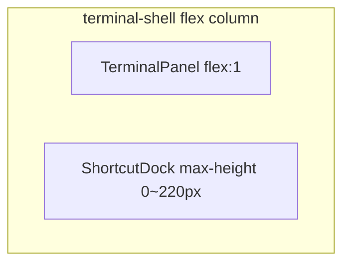

# 快捷坞收起后终端空白区域修复

## 问题根因

从截图可见：点击标题栏「快捷」关闭底部快捷坞后，终端面板**下半部**出现大块黑色空白（xterm 背景色 `#141c28`），命令历史只占据上半部分。

当前布局结构是正确的：



- [`TerminalShell.tsx`](src/components/TerminalShell.tsx)：纵向 flex，`TerminalPanel` 占 `flex: 1`，`ShortcutDock` 在底部
- [`App.css`](src/App.css) 第 701–712 行：收起时 `max-height: 0; overflow: hidden`，展开时 `max-height: 220px`
- 收起后 **CSS 布局空间已归还给终端**，容器高度确实变大了

真正缺的一步在 [`TerminalPanel.tsx`](src/components/TerminalPanel.tsx)：

- xterm 通过 `FitAddon.fit()` 按**当前时刻**容器宽高计算行列数
- 目前仅在 `window.resize`、`history.length` 变化、`inputEnabled` 变化时触发 fit（第 130、224–226 行）
- 快捷坞收起/展开时，**容器高度在 280ms 过渡动画中持续变化**，但 xterm 画布尺寸没有跟着更新 → 底部留下未绘制的黑色区域

`terminal-shell` 上的 `shortcut-open` class 目前**没有任何 CSS 规则**，与问题无关，可忽略。

## 修复方案

### 1. 核心：ResizeObserver 自动 refit（[`TerminalPanel.tsx`](src/components/TerminalPanel.tsx)）

在现有 `useEffect`（初始化 xterm 的那个）中，对 `hostRef` 添加 `ResizeObserver`：

```tsx
const ro = new ResizeObserver(() => safeFit());
if (hostRef.current) ro.observe(hostRef.current);
// cleanup: ro.disconnect()
```

- 快捷坞动画期间容器高度连续变化 → 多次触发 fit → 终端始终铺满
- 同时覆盖 Allotment 拖栏、窗口缩放等所有容器尺寸变化场景
- 复用已有 `safeFit`（含宽高 ≤ 0 保护与 try/catch），不引入新依赖

保留现有 `window.resize` 监听作为兜底（可选，ResizeObserver 已足够）。

### 2. 辅助 CSS：收紧收起态占位（[`App.css`](src/App.css)）

在 `.shortcut-dock` 收起态补充规则，避免过渡结束后残留视觉痕迹：

```css
.shortcut-dock:not(.is-open) {
  height: 0;
  min-height: 0;
  border: none;
}
```

可选：给 `.terminal-panel .terminal` 补 `width: 100%`，确保水平方向也始终铺满（当前只有 `height: 100%`，第 345–347 行）。

### 3. 验收步骤

1. 打开 `http://localhost:5173`，进入自由沙盒
2. 点击「快捷」展开底部快捷坞 → 终端区域缩小，按钮条正常显示
3. 再次点击「快捷」收起 → **终端应立即（动画过程中）铺满整个面板，无底部黑块**
4. 重复开关 3–5 次，确认无闪烁或尺寸滞后
5. 拖动左侧终端/文件区分隔条，确认终端随高度变化正常 refit
6. `npm run build` 通过

## 改动范围

| 文件 | 改动 |
|------|------|
| [`src/components/TerminalPanel.tsx`](src/components/TerminalPanel.tsx) | 添加 ResizeObserver，~10 行 |
| [`src/App.css`](src/App.css) | 收起态 shortcut-dock 零高度 + 可选 terminal 宽度 |

**不需要改动**：`TerminalShell`、`ShortcutDock`、`PlaygroundLayout`（布局逻辑本身正确）。

## 风险与说明

- ResizeObserver 在动画期间会多次调用 `fit()`，xterm 官方推荐做法，性能可接受
- 若未来快捷坞 `max-height` 动画时长调整，ResizeObserver 方案无需同步修改（优于固定 `setTimeout(300)`）
