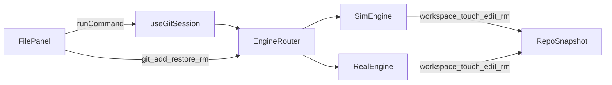

# 文件状态面板交互增强

## 问题与目标

当前 [`FilePanel.tsx`](src/components/FilePanel.tsx) 仅渲染 `snapshot.workingTree` 与 `snapshot.index`，无回调、无按钮。Sim 引擎虽有 `files` / `workingTree` 状态，但**没有对外暴露「创建文件 / 标记修改」的命令**；Real 引擎仅在 `git add` 时通过 `ensureFile` 隐式写文件。

目标：按此前 MVP 方案实现——**底部工具栏 + 单击选中行内操作**，不实现拖拽。



---

## 阶段 1：引擎 `workspace` 伪命令

新建 [`src/engine/workspace.ts`](src/engine/workspace.ts) 统一解析：

```ts
// workspace touch demo.txt | workspace edit README.md | workspace rm demo.txt
export type WorkspaceOp = "touch" | "edit" | "rm";
export function parseWorkspaceCommand(command: string): { op: WorkspaceOp; path: string } | null;
```

### SimEngine（[`src/engine/sim/simEngine.ts`](src/engine/sim/simEngine.ts)）

在 `execute()` 入口优先检测 `workspace` 命令（在 `git` 分支之前）：

| 子命令 | 行为 |
|--------|------|
| `touch <path>` | `files.add(path)`；`workingTree.set(path, "untracked")`；若已在 index 则保持逻辑一致 |
| `edit <path>` | 文件存在则：`clean`→`modified`，`staged` 保持 staged；不存在则等同 touch |
| `rm <path>` | 复用现有 `handleRm` 逻辑（物理删除 + 清 index） |

输出示例：`已创建文件 demo.txt（未跟踪）` / `已标记 README.md 为已修改` / `已删除 demo.txt`

复用已有私有方法 `seedModified()` 用于 `edit`。

### RealEngine（[`src/engine/real/realEngine.ts`](src/engine/real/realEngine.ts)）

在 `tokens[0] !== "git"` 判断**之前**拦截 `workspace`：

| 子命令 | 行为 |
|--------|------|
| `touch` | 调用已有 `ensureFile(path)` |
| `edit` | `ensureFile` 写入新时间戳内容（`refreshSnapshot` 后显示 modified） |
| `rm` | `pfs.unlink` + 若已 init 则 `git.remove`（可选降级为仅删文件） |

Real 模式暂不支持 `git restore` / `git rm`——面板中对「取消暂存 / 丢弃修改」在 `engineMode === "real"` 时**禁用并显示 tooltip**，避免静默失败。

---

## 阶段 2：命令日志来源扩展

[`src/terminal/commandLog.ts`](src/terminal/commandLog.ts)：

```ts
export type CommandSource = "terminal" | "shortcut" | "test" | "file-panel";
```

FilePanel 所有操作经 `onCommand(cmd, { source: "file-panel" })` 记录，终端历史可见 `$ workspace touch demo.txt` 等，与快捷坞/键盘输入共用 timeline。

课程 [`validator.ts`](src/lesson/validator.ts) 仍按 `git ...` 匹配，**不会因面板点按钮误过关**（暂存走 `git add` 仍可帮助过关）。

---

## 阶段 3：交互式 FilePanel

重构 [`src/components/FilePanel.tsx`](src/components/FilePanel.tsx)：

### Props

```ts
interface FilePanelProps {
  snapshot: RepoSnapshot;
  engineMode: EngineMode;
  onCommand: (command: string) => void | Promise<void>;
}
```

### 布局结构

```
┌─ 工作区 ─────────┬─ 暂存区 ─────────┐
│ README.md clean  │ (empty)          │  ← 可点击行，选中高亮
│ app.js   clean   │                  │
├──────────────────┴──────────────────┤
│ [选中文件操作区] 暂存 | 标记修改 | 丢弃修改  │  ← 按状态动态显示
├───────────────────────────────────────┤
│ + 添加文件  − 删除选中  ⇧ 全部暂存      │  ← 底部工具栏
└───────────────────────────────────────┘
```

### 列显示规则

- **工作区**：`workingTree` 中 `status !== "staged"` 的条目（避免与暂存区重复）
- **暂存区**：`snapshot.index` 列表；空时显示 `empty`

### 行点击与上下文操作

维护 `selectedPath` + `selectedZone: "working" | "staged"`：

| 选中位置 | 状态 | 可用按钮 | 命令 |
|----------|------|----------|------|
| 工作区 | untracked/modified | 暂存 | `git add <path>` |
| 工作区 | clean | 标记修改 | `workspace edit <path>` |
| 工作区 | modified | 丢弃修改 | `git restore <path>`（仅 sim） |
| 暂存区 | — | 取消暂存 | `git restore --staged <path>`（仅 sim） |

未 `git init` 时：`git add` / `git restore` 禁用；`workspace touch/edit/rm` 仍可用（与当前 Sim 初始 untracked 文件一致）。

### 底部工具栏

- **添加文件**：复用 [`ParamPickerDialog`](src/components/ParamPickerDialog.tsx)，`quickPicks` 为常见模板 `demo.txt` / `feature.js` / `.gitignore` → `workspace touch <name>`
- **删除选中**：确认后 `workspace rm <path>`（或 `git rm` 若已跟踪且 sim 支持）
- **全部暂存**：`git add .`（需已 init）

### 接入布局

[`PlaygroundLayout.tsx`](src/playground/PlaygroundLayout.tsx) 增加 `engineMode` prop，传入 FilePanel：

```tsx
<FilePanel snapshot={snapshot} engineMode={engineMode} onCommand={(cmd) => onCommand(cmd)} />
```

[`PlaygroundPage.tsx`](src/playground/PlaygroundPage.tsx) / [`LessonPage.tsx`](src/lesson/LessonPage.tsx) 传入 `session.mode`；`onCommand` 包装为 `runCommand(cmd, { source: shortcutId ? "shortcut" : "terminal" })` 需扩展——FilePanel 调用时显式传 `source: "file-panel"`（在 Page 层分支或给 `onCommand` 增加 meta 参数）。

推荐：`PlaygroundLayoutProps.onCommand` 签名改为：

```ts
onCommand: (command: string, meta?: { source?: CommandSource; shortcutId?: string }) => void | Promise<void>;
```

Page 层统一转给 `session.runCommand`。

---

## 阶段 4：样式（[`src/App.css`](src/App.css)）

在现有 `.file-panel` 基础上增加：

- `.file-panel`：`display: flex; flex-direction: column; min-height: 0`
- `.file-groups`：`flex: 1; min-height: 0`（列表区域可滚动）
- `.file-row` / `.file-row.is-selected`：hover 与选中高亮
- `.file-status--untracked|modified|staged|clean`：状态色（复用 `--warning` / `--git-add` 等）
- `.file-action-bar`、`.file-toolbar`：底栏按钮紧凑样式
- `.file-action-bar button:disabled`：Real 模式不可用操作的视觉反馈

---

## 验收标准

- 点「添加文件」→ 工作区出现 `untracked` 新文件；终端历史有 `$ workspace touch ...`
- 点工作区 `modified` 文件 →「暂存」→ 文件移入暂存区列；终端有 `$ git add ...`
- 点暂存区文件 →「取消暂存」→ 回到工作区（sim 模式）
- 点 `clean` 文件 →「标记修改」→ 状态变 `modified`
- 「全部暂存」等价 `git add .`
- 「删除选中」移除文件
- Real 模式：touch/edit/rm + git add 可用；restore 类按钮禁用
- `npm run build` 通过

---

## 暂缓（本次不做）

- 工作区 ↔ 暂存区拖拽
- 文件内容编辑器 / diff 预览
- Real 引擎完整 `git restore` / `git rm` 支持
