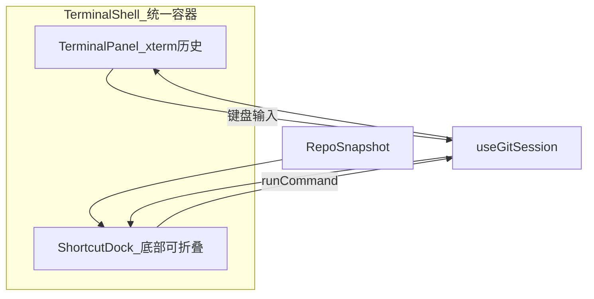

# 终端内嵌快捷坞 + 展开式子按钮

## 目标（对照截图与反馈）

1. **终端与快捷不再分屏** — 始终显示 xterm 终端；点「快捷」只在终端**底部弹出**快捷按钮条，替代手敲命令，历史仍只在终端输出区
2. **子选项完整文案** — `切换…` / `-b …` 改为完整文字（如「切换分支」「新建分支 -b」），禁止省略号截断
3. **展开式按钮组** — 点击 `checkout` 后，**同一外框**向右丝滑扩展，把子按钮包进去；子按钮逐个 stagger 出现
4. **子按钮更小** — `-m`、`--oneline` 等二级 chip 比一级按钮更紧凑
5. **参数弹窗增强** — 保留文本框，底部增加**当前仓库已有分支**等快捷选择按钮（读 `snapshot.refs`）

---

## 架构调整



- 删除 [`PlaygroundLayout`](src/playground/PlaygroundLayout.tsx) 中 `panelMode === "shortcuts"` 整页切换
- 新建 [`TerminalShell.tsx`](src/components/TerminalShell.tsx)：`TerminalPanel` + 可折叠 `ShortcutDock`
- [`GitShortcutPanel`](src/components/GitShortcutPanel.tsx) 精简为 **仅工具栏**（去掉 `.shortcut-log`，历史由 xterm 承担）

---

## 阶段 1：终端内嵌快捷坞

### `TerminalShell.tsx`

```tsx
// 结构示意
<div className="terminal-shell">
  <TerminalPanel history={...} onCommand={...} inputEnabled={!shortcutOpen} />
  <ShortcutDock
    open={shortcutOpen}
    snapshot={snapshot}
    onCommand={onCommand}
  />
</div>
```

### `PlaygroundLayout.tsx` 改动

- 标题固定为「终端」
- `rightSlot` 改为单一开关：**快捷**（toggle `shortcutOpen`，非双 Tab）
- 传入 `snapshot` 给 `TerminalShell`
- 移除对独立 `GitShortcutPanel` 全屏渲染

### 行为

- 默认 `shortcutOpen = false`：纯终端输入
- 打开快捷坞：底部滑出按钮区（`max-height` + `transform` 过渡），xterm 区域自动缩小但仍显示完整命令历史
- 快捷执行仍走 `session.runCommand` — 与键盘输入共用 timeline，切关快捷坞后终端历史完整保留（已实现）

---

## 阶段 2：展开式按钮组 + 动画

### 组件结构（重构 `GitShortcutPanel` → `ShortcutDock`）

每个一级命令渲染为 **pill 组**，而非分散 chip：

```html
<div class="shortcut-pill shortcut-pill--checkout is-expanded">
  <button class="pill-main">checkout</button>
  <div class="pill-options">
    <button class="pill-sub" style="--delay:0">切换分支</button>
    <button class="pill-sub" style="--delay:1">新建分支 -b</button>
  </div>
</div>
```

### CSS（[`App.css`](src/App.css)）

- `.shortcut-pill`：`display: inline-flex; align-items: center; border-radius: 8px; overflow: hidden; border: 1px solid ...`
- 未展开：仅显示 `.pill-main`
- `.is-expanded`：`max-width` 从 `fit-content(主按钮)` 过渡到包裹全部子按钮（`transition: max-width 280ms ease`）
- `.pill-sub`：`max-width: 0; opacity: 0` → 展开时 `max-width: 120px; opacity: 1`，`transition-delay: calc(var(--delay) * 80ms)` 实现逐个出现
- `.pill-sub`：`font-size: 10px; padding: 3px 8px`（小于 `.pill-main` 的 `12px / 6px 10px`）
- 工具栏 `.shortcut-toolbar` 保持 `flex-wrap: wrap`，pill 之间 `gap: 6px`

### 文案修正（[`shortcuts.ts`](src/terminal/shortcuts.ts)）

| 现文案 | 改为 |
|--------|------|
| `切换…` | `切换分支` |
| `-b …` | `新建分支 -b` |
| `-c …` | `新建分支 -c` |
| `新建…` | `新建分支` |
| `文件…` | `指定文件` |
| `合并…` | `合并分支` |
| `add …` | `添加远程` |

---

## 阶段 3：参数弹窗 + 分支快选

### 扩展 `ShortcutOption`（[`shortcuts.ts`](src/terminal/shortcuts.ts)）

```ts
input?: {
  placeholder: string;
  wrap: (value: string) => string;
  picker?: "branch" | "file";  // 快选类型
};
```

为 `checkout`/`switch`/`merge` 的「切换分支」「合并分支」等选项加 `picker: "branch"`。

### 新建 [`src/terminal/snapshotHelpers.ts`](src/terminal/snapshotHelpers.ts)

```ts
export function getLocalBranchNames(snapshot: RepoSnapshot): string[];
export function getTrackedFileNames(snapshot: RepoSnapshot): string[];
```

从 `snapshot.refs`（`type === "branch"`）和 `snapshot.files` 提取。

### 升级 [`TextInputDialog.tsx`](src/components/TextInputDialog.tsx) → `ParamPickerDialog.tsx`

Props 增加：

- `quickPicks?: string[]` — 底部分支/文件按钮
- 点击快选 → 等同确认并填入该值
- 仍保留顶部文本输入（自定义分支名）

`ShortcutDock` 打开弹窗时根据 `option.input.picker` 从 `snapshot` 计算 `quickPicks`。

---

## 阶段 4：清理与验收

| 文件 | 动作 |
|------|------|
| [`TerminalShell.tsx`](src/components/TerminalShell.tsx) | **新建** 终端+快捷坞容器 |
| [`ShortcutDock.tsx`](src/components/ShortcutDock.tsx) | **新建**（由 GitShortcutPanel 改名/重构） |
| [`ParamPickerDialog.tsx`](src/components/ParamPickerDialog.tsx) | **新建** 替代 TextInputDialog |
| [`GitShortcutPanel.tsx`](src/components/GitShortcutPanel.tsx) | **删除** 或改为 re-export ShortcutDock |
| [`PlaygroundLayout.tsx`](src/playground/PlaygroundLayout.tsx) | 接入 TerminalShell，去掉双 Tab |
| [`shortcuts.ts`](src/terminal/shortcuts.ts) | 完整文案 + picker 标记 |
| [`snapshotHelpers.ts`](src/terminal/snapshotHelpers.ts) | **新建** |
| [`App.css`](src/App.css) | pill 展开动画、dock 滑出、子按钮尺寸 |

### 验收标准

- 界面始终是一个终端窗口；点「快捷」底部滑出按钮条，再点收起
- 快捷执行的命令出现在 xterm 历史区；关闭快捷坞后历史不丢
- `checkout` 展开时外框向右扩展，「切换分支」「新建分支 -b」依次出现，文字完整无省略号
- `-m` 等子按钮明显小于 `commit` 一级按钮
- 点「切换分支」弹窗：有输入框 + 当前分支名按钮（如 `main`）；选按钮直接执行 `git checkout main`
- `npm run build` 通过

---

## 暂缓

- 快捷坞内再显示一份独立记录列表（已由终端承担）
- 文件快选以外的复杂 picker（远程 URL 模板等）
