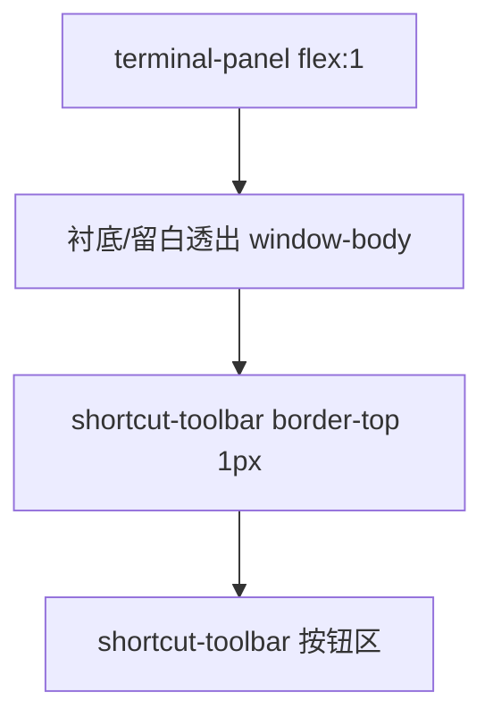

# 终端与快捷坞配色统一

## 问题分析

当前终端区域存在三层不一致的底色：

| 层级 | 当前色值 | 来源 |
|------|----------|------|
| xterm 画布 | `#141c28` 深蓝 | [`TerminalPanel.tsx`](src/components/TerminalPanel.tsx) `darkTerminalTheme` |
| 窗口 body 衬底 | `#3a3a3a` 灰 | [`index.css`](src/index.css) `--terminal-bg` → [`.window-dark .window-body`](src/App.css) |
| 快捷坞工具栏 | `rgba(0,0,0,0.15)` 半透明 | [`.shortcut-toolbar`](src/App.css) 第 698–699 行 |

页面主背景已是 `#080808`，三者叠加后视觉冲突明显。

中间「黑色条」的可能来源：



1. **`.shortcut-toolbar { border-top: 1px solid rgba(255,255,255,0.1) }`** — 在终端底与快捷坞顶之间形成明显横线
2. **`.shortcut-dock` 无背景色** — flex 子项之间若 xterm 未铺满 `terminal-panel` 底部，会透出 `window-body` 衬底（与 xterm 色差形成条带）
3. **`max-height: 220px` 展开动画** — 过渡期间容器高度与内容高度短暂不一致，可能露出衬底

## 修复方案

### 1. 统一终端色板（[`src/index.css`](src/index.css)）

将 `--terminal-bg` 从 `#3a3a3a` 改为与黑色主题一致的 `#111111`（或 `#0f0f0f`），`[data-theme="light"]` 下保持 `#3a3a3a` 不变。

### 2. 同步 xterm 主题色（[`src/components/TerminalPanel.tsx`](src/components/TerminalPanel.tsx)）

```ts
const darkTerminalTheme = {
  background: "#111111",  // 与 --terminal-bg 一致
  foreground: "#e5e5e5",
  cursor: "#c8e600",
};
```

不改字体、光标逻辑，仅对齐背景/前景色。

### 3. 统一容器衬底，消除缝隙（[`src/App.css`](src/App.css)）

```css
.terminal-shell {
  gap: 0;
  background: var(--terminal-bg);
}

.terminal-panel,
.terminal-panel .terminal,
.terminal-panel .xterm-viewport {
  background: var(--terminal-bg);
}

.shortcut-dock.is-open {
  background: var(--terminal-bg);
}

.shortcut-toolbar {
  background: var(--terminal-bg);
  border-top: none;          /* 去掉横条分隔线 */
  padding: 8px 10px 10px;
}
```

- `gap: 0` 确保 flex 子项无间距
- 整条 `terminal-shell` 链路同色，即使 xterm fit 有 1–2px 误差也不露异色
- 移除 `border-top` 去掉用户看到的「黑条/灰条」

### 4. 收紧快捷坞展开高度（[`src/App.css`](src/App.css)）

将 `.shortcut-dock.is-open` 的 `max-height: 220px` 改为更贴近实际内容的上限，避免动画结束后容器高于内容留下空白：

```css
.shortcut-dock.is-open {
  max-height: 160px;   /* 3 行 pill 足够，减少过渡留白 */
  opacity: 1;
}
```

若实测 3 行按钮仍被裁切，调至 `180px`；原则是不保留大块无内容高度。

### 5. 不改动的部分

- 全局 `button {}`、`.shortcut-pill` / `.pill-sub` 快捷按钮样式
- xterm 交互、ResizeObserver、FitAddon 逻辑
- `WindowChrome` 标题栏

## 涉及文件

- [`src/index.css`](src/index.css) — `--terminal-bg`
- [`src/components/TerminalPanel.tsx`](src/components/TerminalPanel.tsx) — `darkTerminalTheme`
- [`src/App.css`](src/App.css) — `.terminal-shell`、`.shortcut-dock`、`.shortcut-toolbar`、xterm viewport 衬底

## 验证清单

1. 打开快捷坞：终端区与快捷按钮区底色一致，无明显色差
2. 终端底与快捷坞顶之间无横条/黑缝
3. 快捷坞 3 行按钮完整显示，无裁切
4. 收起/展开快捷坞动画仍流畅
5. `npm run build` 通过
