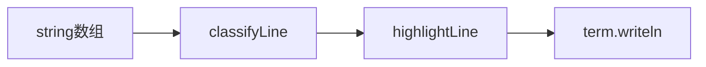

# 终端命令行语法高亮方案

## 现状

[`src/components/TerminalPanel.tsx`](src/components/TerminalPanel.tsx) 通过 xterm.js 输出历史，所有行均为纯文本：

```76:84:src/components/TerminalPanel.tsx
  const printHistoryLines = (lines: string[]) => {
    // ...
    lines.forEach((line) => term.writeln(line));
```

历史数据来源：
- [`useGitSession.run()`](src/hooks/useGitSession.ts) 写入 `$ {command}` + 引擎 `output`
- [`appendHistory()`](src/hooks/useGitSession.ts) 写入系统行（如 `----- 引擎切换为 REAL -----`）

终端背景为深色（`#3a3a3a` / `#141c28`），适合用 **ANSI 转义码** 着色，无需新依赖。

---

## 方案：渲染时着色（最小侵入）

新增纯函数模块 [`src/terminal/highlight.ts`](src/terminal/highlight.ts)，在 `TerminalPanel` 写入 xterm 前将每行转为带 ANSI 的字符串。



**不修改** `history` 结构、session、引擎 —— 高亮仅在 L2 展示层完成。

---

## 行分类与配色

针对截图中的典型输出，定义 5 类规则（优先级从上到下）：

| 类型 | 匹配规则 | 样式 |
|------|----------|------|
| `system` | `/^----- .+ -----$/` | 暗青色整行（引擎切换、进入关卡） |
| `error` | 含 `错误`、`fatal:`、`不支持`、`未知命令` | 红色整行或红色关键词 |
| `success` | 以 `real>` 开头，或含 `已执行`、`已重置` | 青色前缀 + 默认正文 |
| `command` | 以 `$ ` 或 `: ` 开头且含 `git` | 绿色 `$` + Git 命令内部分词高亮 |
| `gitOutput` | commit 行、`file changed`、stash 等 | 分支/哈希/数字局部高亮 |
| `plain` | 其余 | 默认前景色 |

### Git 命令内部分词（`command` 类型）

对 `$ git commit -m "msg"` 等行做轻量 token 高亮：

- `git` → 亮绿
- 子命令（`init` / `add` / `commit` / `checkout` …）→ 青色
- 标志（`-m` / `-u` / `--oneline` 等）→ 黄色
- 引号字符串 → 橙色

实现方式：正则分段替换，注意先转义再拼接 ANSI，末尾加 `\x1b[0m` 重置。

### Git 输出（`gitOutput` 类型）

- `[branch hash]` 格式中 `hash` → 黄色
- `N file(s) changed` 中数字 → 黄色
- `stash@{n}` → 黄色

---

## 代码改动

### 1. 新建 `src/terminal/highlight.ts`

导出：

```ts
export type LineKind = "system" | "error" | "success" | "command" | "gitOutput" | "plain";

export function classifyLine(line: string): LineKind;
export function highlightLine(line: string): string;
```

内部维护 `ANSI` 常量（绿/青/黄/红/橙/暗青/重置），以及 `highlightGitTokens(cmd: string)` 辅助函数。

### 2. 修改 `TerminalPanel.tsx`

- `printHistoryLines`：`term.writeln(highlightLine(line))` 替代 `term.writeln(line)`
- （可选增强）`renderPromptLine`：对 `PROMPT` 使用 `\x1b[32m$\x1b[0m `，若 buffer 以 `git` 开头则对 buffer 调用 `highlightGitTokens`（仅影响当前输入行，提升输入时反馈）

### 3. 不改动

- `useGitSession` / 引擎输出文本
- xterm theme 配置（ANSI 与 theme.foreground 可共存）
- 课程/沙盒路由逻辑

---

## 验收标准

- `$ git commit -m "..."` 中 `git`、`commit`、`-m`、引号内容颜色可区分
- `----- 引擎切换为 REAL -----` 显示为系统提示色
- `real 模式暂不支持 git checkout`、`real 引擎错误：EISDIR` 显示为错误色
- `real> 已执行 git init` 前缀与正文可区分
- commit 输出中 hash 有高亮
- 明暗主题切换后高亮仍可读（配色针对深色背景固定，与现有终端背景一致）
- `npm run build` 通过

---

## 预估工作量

约 0.5 天：1 个新文件 + `TerminalPanel` 约 5–10 行改动。
