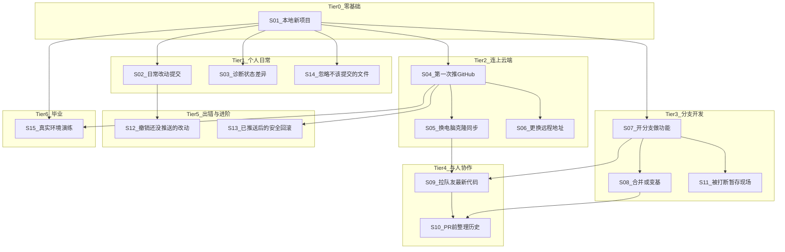

# 课程文档整理与场景化规划

## 背景

当前课程权威数据源为 [`src/lessons/data.ts`](src/lessons/data.ts)，共 **13 个 World、57 个 Step**，按 **Git 命令类型** 组织（初始化、远程、分支、撤销等）。[`docs/使用指南.md`](docs/使用指南.md) 仅有 13 关摘要表，缺少逐步详情。

用户希望：
1. 把**现有课程**整理成完整 Markdown → 放在 **`docs/lesson/`**（不是 license）
2. 另写一篇**场景驱动**的课程规划，考虑场景间依赖，每段小课从一个真实情境出发

本次**只写文档，不改代码**；后续若要按场景重构 `data.ts`，可再开一轮实现。

---

## 交付物

| 文件 | 用途 |
|------|------|
| [`docs/lesson/现有课程目录.md`](docs/lesson/现有课程目录.md) | 与 `data.ts` 一一对应的课程 inventory |
| [`docs/lesson/场景化课程规划.md`](docs/lesson/场景化课程规划.md) | 按场景重组 + 依赖图 + 与现有 World 映射 + 待补场景 |

新建目录 `docs/lesson/`（当前 `docs/` 下只有 3 篇通用文档，尚无 lesson 子目录）。

---

## 文档一：`现有课程目录.md` 结构

内容从 [`src/lessons/data.ts`](src/lessons/data.ts) 导出，并在文首注明：

- **数据源**：`src/lessons/data.ts`（改课程时以代码为准，本文档为可读镜像）
- **统计**：13 World / 57 Step；Sim 1–12，Real 13
- **类型说明**：`mode`、`seedId`、`riskLevel`（basic / advanced / danger）

每个 World 统一格式：

```markdown
## World N — 标题
- **id**: worldN
- **模式**: sim | real
- **种子**: empty | two-branches | with-remote
- **描述**: ...

| 步骤 id | 标题 | 指令摘要 | commandHint | 风险 |
|---------|------|----------|-------------|------|
| wN-xxx  | ...  | ...      | git ...     | basic |
```

文末附录：
- **全项目 Git 命令索引**（按类别：初始化 / 暂存 / 提交 / 分支 / 远程 / 撤销 / stash / ignore）
- **种子使用情况**（[`src/engine/seed.ts`](src/engine/seed.ts) 中 `empty`、`two-branches`、`with-remote` 及未使用的 seed）
- **与使用指南的关系**：使用指南讲「怎么用网站」，本文档讲「教什么」

不重复 [`docs/使用指南.md`](docs/使用指南.md) 里的运行说明，只在文首链过去。

---

## 文档二：`场景化课程规划.md` 结构

### 设计原则

- **每课 = 一个「你遇到了什么事」的故事**，而不是「今天学 branch 命令」
- **依赖 = 前置场景已掌握的技能**，不是必须按 World 编号顺序
- **尽量复用现有引擎能力**（Sim seed、validator 模式），新场景优先映射已有 World，缺口单独标注「待新建」

### 场景分层与依赖



### 各场景概要（写入文档正文）

| 场景 ID | 情境（用户故事） | 核心命令 | 前置依赖 | 映射现有 World |
|---------|------------------|----------|----------|----------------|
| **S01** | 写了个小项目，第一次用 Git 管版本 | init, add, commit, log, status | 无 | W1 |
| **S02** | 改完代码，按习惯暂存并提交 | add 单文件/全部, commit -m, commit -am | S01 | W5 |
| **S03** | 不确定改了什么、有没有暂存 | status, diff, diff --staged, remote -v | S01 | W4 |
| **S04** | 本地项目要备份/展示到 GitHub | branch -M, remote add, push -u | S01 | W2 |
| **S05** | 新电脑或同事给你仓库地址 | clone, fetch, pull | S04（或已有远程仓库） | W3 |
| **S06** | 仓库从 HTTPS 换 SSH，或 fork 后换 origin | remote -v, remote set-url | S04 | W12（部分）、W4 |
| **S07** | 加新功能不想弄乱 main | branch, switch -c, checkout -b | S01 | W6 |
| **S08** | feature 做完要合回主线 | merge, rebase（进阶） | S07 | W7 |
| **S09** | 多人改同一仓库，开工前先同步 | fetch, pull, pull --rebase | S05 + S07 | W3 + W12（部分） |
| **S10** | 提 PR 前让提交历史干净、只看自己的改动 | rebase origin/main, log origin/main..HEAD | S08 + S09 | W12 |
| **S11** | 改到一半要切分支修 bug | stash, stash list, stash pop | S07 | W8 |
| **S12** | 暂存错了 / 提交错了但还没 push | restore, restore --staged, reset --soft | S02 | W9 |
| **S13** | 已经 push 了，发现提交有问题 | commit --amend, revert, reset --hard（危险演示） | S04 + S12 | W10 |
| **S14** | node_modules、.env 不想进仓库 | .gitignore, rm --cached | S01 | W11 |
| **S15** | 在浏览器真实 Git 引擎里完整走一遍 | init → add → commit → log | S01–S04 建议完成 | W13 |

### 推荐学习路径（写入文档）

文档中给出 **三条路径**，满足不同目标：

1. **最短上手**（个人单机）：S01 → S02 → S04 → S15  
2. **日常开发者**：S01 → S02 → S03 → S04 → S05 → S07 → S08 → S14  
3. **团队协作**：在路径 2 基础上 → S09 → S10 → S06；并行可学 S11、S12、S13  

### 与现有 World 的差异说明

当前 13 World 是**命令维度**排列，场景文档会明确指出：

- **内容重叠**：W1/W5/W4 都可归入「个人日常」，学习时可按场景跳读，不必严格 W1→W13
- **顺序可优化**：例如 W2（推 GitHub）在 W4/W5 之前，场景路径会把「诊断/日常提交」放在推远程之前更自然
- **待补场景**（现有 World 未覆盖或较弱）：
  - **冲突解决**：merge/rebase 遇到 conflict 时的标记与解决（当前 W7 只教命令，无冲突情境）
  - **Fork + 上游同步**：fork 他人项目、添加上游 remote、sync fork
  - **Tag / Release**：发版本打 tag
  - **Cherry-pick**：只拿某个 commit
  - 这些在场景文档中列为 **Phase 2 扩展**，不纳入本次 inventory

### 场景文档每节模板

每个场景一节，包含：

- **情境描述**（2–3 句，像游戏任务简报）
- **你会用到什么 Git 操作**（命令列表）
- **前置场景**（必须先会什么）
- **对应现有 World / Step**（可点击到文档一中的锚点）
- **建议 seed / mode**（实现新关时的参考）
- **学完能做什么**（能力验收一句话）

---

## 实施步骤

1. 创建 `docs/lesson/` 目录
2. 通读 [`src/lessons/data.ts`](src/lessons/data.ts) 全文，生成 `现有课程目录.md`（57 步完整表格 + 命令索引）
3. 撰写 `场景化课程规划.md`（依赖 mermaid 图 + 15 场景详表 + 三条学习路径 + Phase 2 扩展清单）
4. 在 [`docs/使用指南.md`](docs/使用指南.md) 的「关卡一览」小节末尾加一行链接：「逐步详情见 [docs/lesson/现有课程目录.md](lesson/现有课程目录.md)」——**可选**，若你希望 docs 互相串联；用户未明确要求则可省略以保持最小 diff

---

## 不在本次范围

- 修改 `src/lessons/data.ts` 或新增 World
- 实现场景化 UI（按场景选关而非按 World 编号）
- 编写 Unity / 游戏相关代码（用户 rule 中的 Unity 上下文与本 React 项目无关，忽略）
