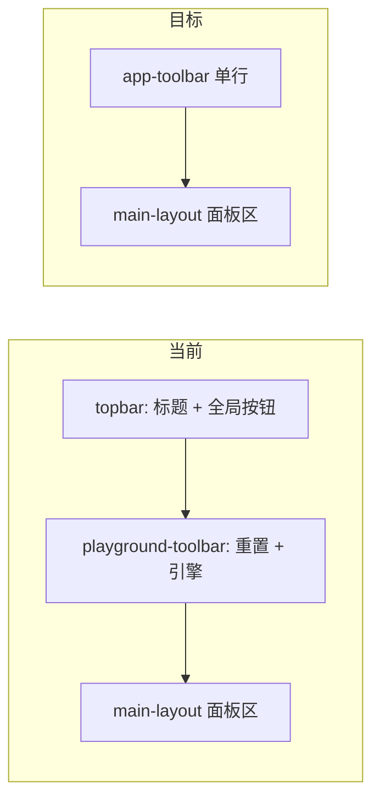

# 顶栏合并与黑色主题重构

## 现状

当前布局分两行（见用户截图）：

| 行 | 位置 | 内容 |
|----|------|------|
| 顶栏 | [`src/App.tsx`](src/App.tsx) `.topbar` | 标题「Git 命令行教学网站」+ 模式/测试/音效/夜间模式 |
| 沙盒栏 | [`src/playground/PlaygroundPage.tsx`](src/playground/PlaygroundPage.tsx) `.playground-toolbar` | 重置仓库、引擎切换 |

页面背景由 [`src/index.css`](src/index.css) 的 `--canvas-blue` 控制（日间 `#8fd3f4` 浅蓝，夜间 `#0f1a2e` 深蓝）。Mac 红黄绿圆点在 [`src/components/WindowChrome.tsx`](src/components/WindowChrome.tsx) 的 `.window-dots` 中渲染，无实际功能。



## 实现方案

### 1. 合并为单行顶栏（[`src/App.tsx`](src/App.tsx)）

- 删除 `<h1>Git 命令行教学网站</h1>` 及其包裹 div
- 将 `.topbar` 重命名为 `.app-toolbar`，采用左右两组 flex：

```tsx
<header className="app-toolbar">
  <div className="app-toolbar-left">
    {appMode === "playground" && (
      <>
        <button onClick={handleResetRepo}>重置仓库</button>
        <button onClick={handleToggleEngine}>引擎: {session.mode.toUpperCase()}</button>
      </>
    )}
  </div>
  <div className="app-toolbar-actions">
    <button onClick={() => setHelpOpen(true)}>使用说明</button>
    {/* 自由沙盒 / 课程模式 / 测试 / 音效 / 夜间模式 */}
  </div>
</header>
```

- `handleResetRepo` / `handleToggleEngine` 逻辑从 [`PlaygroundPage.tsx`](src/playground/PlaygroundPage.tsx) 上移到 `App`（`session` 已在 App 中通过 `useGitSession()` 持有）
- 课程模式不显示「重置仓库 / 引擎」（与现行为一致：LessonPage 无第二行）

### 2. 移除沙盒独立工具栏

- 删除 [`PlaygroundPage.tsx`](src/playground/PlaygroundPage.tsx) 中的 `.playground-toolbar` 区块及 `toggleMode` 本地回调（保留 `onCommand` 等页面逻辑）
- 删除 [`src/App.css`](src/App.css) 中 `.playground-toolbar` 样式；`.playground-page` 改为直接占满高度，去掉 `gap: 10px` 留给已删除的第二行

### 3. 新增「使用说明」弹窗

新建 [`src/components/HelpDialog.tsx`](src/components/HelpDialog.tsx)，复用现有 `.text-input-dialog-backdrop` 模式（参考 [`ParamPickerDialog.tsx`](src/components/ParamPickerDialog.tsx)）：

- `open` / `onClose` props
- 标题：「使用说明」
- 正文提炼自 [`docs/使用指南.md`](docs/使用指南.md) 第二节，分块展示：
  - 自由沙盒 vs 课程模式
  - 左栏：终端、文件状态、快捷坞
  - 右栏：Graph View、目标浮层（课程模式）
  - 终端技巧：Tab 补全、上下键历史
  - 内置命令：`hint` / `levels` / `reset`
- 底部仅「知道了」按钮
- 在 `App.tsx` 管理 `helpOpen` 状态

弹窗样式在 `App.css` 新增 `.help-dialog` / `.help-dialog-body`（黑色主题适配），**不改**全局 `button {}` 规则。

### 4. 移除 Mac 红黄绿装饰

[`WindowChrome.tsx`](src/components/WindowChrome.tsx)：

- 删除 `<div className="window-dots">` 整块
- 标题栏改为两列：`title` + `rightSlot`

[`App.css`](src/App.css)：

- 删除 `.window-dots` 及相关 `span:nth-child` 规则
- `.window-titlebar` 网格改为 `grid-template-columns: 1fr auto`，标题左对齐

### 5. 黑色主题（[`src/index.css`](src/index.css) + [`App.css`](src/App.css)）

 aesthetic 方向（frontend-design skill）：**obsidian 纯黑工业风**——低饱和、细边框、面板层次分明，终端区域保持现有深色不变。

**CSS 变量调整（两主题均以黑为基底，夜间为默认）：**

| 变量 | 新值方向 |
|------|----------|
| `--canvas-blue` | `#080808`（主背景，变量名可保留避免大范围重命名） |
| `--bg` / `--bg-soft` / `--bg-elevated` | `#0a0a0a` / `#0f0f0f` / `#141414` |
| `--border` | `#2a2a2a` |
| `--topbar-bg` | `#111111` 纯色或极弱渐变 |
| `--window-chrome` | `#1a1a1a` |
| `--shadow-elevated` / `--shadow-window` | 更深、更弱的黑色阴影 |
| graph / file / goal 相关变量 | 去蓝调，改为 `#111`–`#1e1e1e` 系 |

[`App.tsx`](src/App.tsx)：`darkMode` 默认值改为 `true`，首次访问即为黑色主题（仍可通过「夜间模式」切换）。

**明确不改动的样式：**
- 全局 `button {}` 与 `button:hover`
- `.terminal-*`、xterm、`.shortcut-*`、`.pill-*`、`.git-token--*`
- 快捷坞子按钮已修复的层级样式

**需要改动的非终端面板样式（`App.css`）：**
- `.app-shell`、`.app-toolbar`（原 `.topbar`）
- `.window-chrome`、`.window-titlebar`、`.window-body`（light 变体）
- `.file-panel`、`.graph-panel`、`.graph-empty-*`
- `.lesson-*`、`.goal-*`、`.floating-panel-*`
- `.text-input-dialog` / `.help-dialog` 背景与边框
- `--sash-bg` 分隔条

### 6. 顶栏样式微调

```css
.app-toolbar {
  display: flex;
  justify-content: space-between;
  align-items: center;
  padding: 8px 12px;
  border: 1px solid var(--border);
  background: var(--topbar-bg);
  border-radius: 8px;   /* 略收紧，配合黑色主题 */
}
.app-toolbar-left,
.app-toolbar-actions {
  display: flex;
  gap: 8px;
  align-items: center;
}
```

## 涉及文件

| 文件 | 操作 |
|------|------|
| [`src/App.tsx`](src/App.tsx) | 合并顶栏、上移沙盒控制、Help 状态、默认 darkMode |
| [`src/playground/PlaygroundPage.tsx`](src/playground/PlaygroundPage.tsx) | 删除第二行工具栏 |
| [`src/components/HelpDialog.tsx`](src/components/HelpDialog.tsx) | 新建 |
| [`src/components/WindowChrome.tsx`](src/components/WindowChrome.tsx) | 移除 window-dots |
| [`src/index.css`](src/index.css) | 黑色主题 CSS 变量 |
| [`src/App.css`](src/App.css) | 顶栏/面板/弹窗样式，删除 dots 与 playground-toolbar |

## 验证清单

1. 页面仅一行顶栏：沙盒模式下左侧「重置仓库 / 引擎」，右侧含「使用说明」及原有按钮；无站点标题
2. 课程模式顶栏无重置/引擎，其余按钮正常
3. 点击「使用说明」弹出指南，Esc/点击遮罩/「知道了」可关闭
4. 各面板标题栏无红黄绿圆点，标题左对齐
5. 页面背景为黑色系，终端与按钮外观与改前一致
6. `npm run build` 通过
