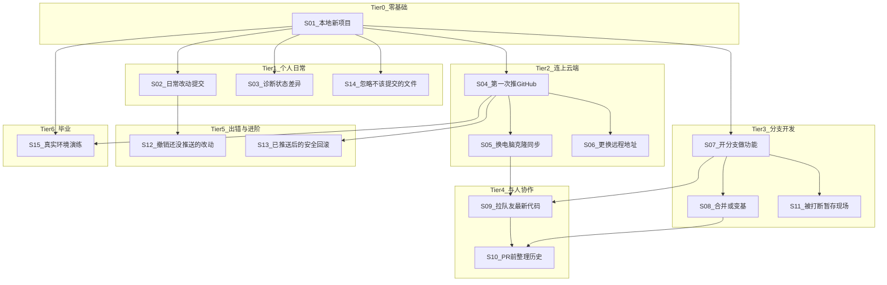

# 场景化课程规划

本文档按**实际使用场景**重组 Git Learn 课程：每段小课从一个「你遇到了什么事」的情境出发，并标注场景之间的前置依赖。

- **现有命令型课程 inventory**：见 [现有课程目录](./现有课程目录.md)
- **权威数据源**（实现关卡时）：[`src/lessons/data.ts`](../../src/lessons/data.ts)
- **本文档定位**：规划与设计参考；尚未改动应用内关卡顺序或 UI

---

## 设计原则

1. **每课 = 一个故事**：先讲「为什么要做」，再练「怎么做」
2. **依赖 = 技能前置**：必须先会 init/commit 才能 push；必须先会分支才能 merge
3. **复用现有引擎**：优先映射已有 World 1–13；缺口标注「待新建」
4. **不必按 World 编号顺序学**：可按场景路径跳读，World 编号仅作代码索引

---

## 场景分层与依赖



---

## 场景速查表

| 场景 ID | 情境（用户故事） | 核心命令 | 前置依赖 | 映射现有 World |
|---------|------------------|----------|----------|----------------|
| **S01** | 写了个小项目，第一次用 Git 管版本 | init, add, commit, log, status | 无 | [W1](./现有课程目录.md#world-1--初始化仓库) |
| **S02** | 改完代码，按习惯暂存并提交 | add 单文件/全部, commit -m, commit -am | S01 | [W5](./现有课程目录.md#world-5--提交流程) |
| **S03** | 不确定改了什么、有没有暂存 | status, diff, diff --staged, remote -v | S01 | [W4](./现有课程目录.md#world-4--状态与诊断) |
| **S04** | 本地项目要备份/展示到 GitHub | branch -M, remote add, push -u | S01 | [W2](./现有课程目录.md#world-2--连接-github) |
| **S05** | 新电脑或同事给你仓库地址 | clone, fetch, pull | S04 | [W3](./现有课程目录.md#world-3--克隆与同步) |
| **S06** | 仓库从 HTTPS 换 SSH，或 fork 后换 origin | remote -v, remote set-url | S04 | [W12](./现有课程目录.md#world-12--协作收尾)（部分）、[W4](./现有课程目录.md#world-4--状态与诊断) |
| **S07** | 加新功能不想弄乱 main | branch, switch -c, checkout -b | S01 | [W6](./现有课程目录.md#world-6--分支操作) |
| **S08** | feature 做完要合回主线 | merge, rebase | S07 | [W7](./现有课程目录.md#world-7--合并与变基) |
| **S09** | 多人改同一仓库，开工前先同步 | fetch, pull, pull --rebase | S05 + S07 | [W3](./现有课程目录.md#world-3--克隆与同步) + [W12](./现有课程目录.md#world-12--协作收尾)（部分） |
| **S10** | 提 PR 前让提交历史干净、只看自己的改动 | rebase origin/main, log origin/main..HEAD | S08 + S09 | [W12](./现有课程目录.md#world-12--协作收尾) |
| **S11** | 改到一半要切分支修 bug | stash, stash list, stash pop | S07 | [W8](./现有课程目录.md#world-8--暂存现场) |
| **S12** | 暂存错了 / 提交错了但还没 push | restore, restore --staged, reset --soft | S02 | [W9](./现有课程目录.md#world-9--撤销基础) |
| **S13** | 已经 push 了，发现提交有问题 | commit --amend, revert, reset --hard | S04 + S12 | [W10](./现有课程目录.md#world-10--风险与回滚) |
| **S14** | node_modules、.env 不想进仓库 | .gitignore, rm --cached | S01 | [W11](./现有课程目录.md#world-11--忽略规则) |
| **S15** | 在浏览器真实 Git 引擎里完整走一遍 | init → add → commit → log | S01–S04 建议完成 | [W13](./现有课程目录.md#world-13--真实沙盒收官) |

---

## 推荐学习路径

### 路径 1：最短上手（个人单机）

适合只想把本地项目管起来、推到 GitHub 的学习者。

```
S01 → S02 → S04 → S15
```

### 路径 2：日常开发者

适合日常写代码、需要诊断状态和忽略规则的人。

```
S01 → S02 → S03 → S04 → S05 → S07 → S08 → S14
```

### 路径 3：团队协作

在路径 2 基础上，加上多人协作与 PR 流程；S11、S12、S13 可并行穿插。

```
路径 2 → S09 → S10 → S06
         ↘ S11、S12、S13（按需）
```

---

## 场景详情

### S01 — 本地新项目

**情境**：你刚写完一个小项目（几个源文件），想开始用 Git 记录版本，避免改乱找不回来。

**你会用到什么 Git 操作**：

- `git init` — 在当前目录创建仓库
- `git add .` — 把文件放进暂存区
- `git commit -m "..."` — 创建第一个快照
- `git log --oneline` — 查看历史
- `git status` — 确认工作区干净

**前置场景**：无

**对应现有 World / Step**：[World 1](./现有课程目录.md#world-1--初始化仓库)（w1-init → w1-status，共 5 步）

**建议 seed / mode**：`empty` / `sim`

**学完能做什么**：独立在本地初始化仓库并完成第一次提交，能看懂 status 和 log 输出。

---

### S02 — 日常改动提交

**情境**：项目已经在 Git 管理下，你改了几个文件，想按习惯「先看改了什么 → 暂存 → 提交」。

**你会用到什么 Git 操作**：

- `git add <file>` / `git add .` — 选择性或全部暂存
- `git commit -m "..."` — 带说明提交
- `git commit -am "..."` — 对已跟踪文件跳过 add 直接提交

**前置场景**：S01

**对应现有 World / Step**：[World 5](./现有课程目录.md#world-5--提交流程)（w5-init → w5-commit-am，共 5 步）

**建议 seed / mode**：`empty` / `sim`

**学完能做什么**：掌握日常改代码后的标准提交流程，知道 `-am` 的适用边界（仅已跟踪文件）。

---

### S03 — 诊断状态差异

**情境**：终端提示有改动，但你不确定改了哪些文件、有没有已经 add 进暂存区。

**你会用到什么 Git 操作**：

- `git status` — 工作区 vs 暂存区概览
- `git diff` — 未暂存的行级差异
- `git diff --staged` — 已暂存的差异
- `git remote -v` — 查看远程地址（顺带认识 remote）

**前置场景**：S01

**对应现有 World / Step**：[World 4](./现有课程目录.md#world-4--状态与诊断)（w4-init → w4-remote-v，共 5 步）

**建议 seed / mode**：`empty` / `sim`

**学完能做什么**：提交前能自行诊断「改了什么、暂存了什么」，不再盲目 add。

---

### S04 — 第一次推 GitHub

**情境**：本地项目已经能 commit 了，你想备份到 GitHub 或给别人看。

**你会用到什么 Git 操作**：

- `git branch -M main` — 统一默认分支名
- `git remote add origin <url>` — 关联远程仓库
- `git push -u origin main` — 首次推送并建立跟踪

**前置场景**：S01

**对应现有 World / Step**：[World 2](./现有课程目录.md#world-2--连接-github)（w2-init → w2-push-u，共 4 步）

**建议 seed / mode**：`empty` / `sim`

**学完能做什么**：把本地仓库推到 GitHub（或同类平台），理解 origin 与 upstream 跟踪关系。

---

### S05 — 换电脑克隆同步

**情境**：你在新电脑上，同事发给你一个仓库地址；或者你在家和公司两台机器之间同步代码。

**你会用到什么 Git 操作**：

- `git clone <url>` — 一次性拷贝完整仓库
- `git fetch` — 只拉远程对象，不自动合并
- `git pull` — 拉取并合并到当前分支
- `git pull --rebase` — 拉取并以 rebase 方式整合（进阶）

**前置场景**：S04（或已有可访问的远程仓库）

**对应现有 World / Step**：[World 3](./现有课程目录.md#world-3--克隆与同步)（w3-clone → w3-pull-rebase，共 4 步）

**建议 seed / mode**：`empty` / `sim`

**学完能做什么**：在新环境拿到项目，日常用 pull 保持与远程同步；知道 fetch 与 pull 的区别。

---

### S06 — 更换远程地址

**情境**：公司要求从 HTTPS 换成 SSH；或者你 fork 了别人的项目，需要把 origin 改成自己的 fork 地址。

**你会用到什么 Git 操作**：

- `git remote -v` — 确认当前地址
- `git remote set-url origin <new-url>` — 修改 origin

**前置场景**：S04

**对应现有 World / Step**：[World 12](./现有课程目录.md#world-12--协作收尾) 的 w12-remote-set-url；诊断部分见 [World 4](./现有课程目录.md#world-4--状态与诊断) 的 w4-remote-v

**建议 seed / mode**：`with-remote` 或 `empty` / `sim`

**学完能做什么**：在不重建仓库的情况下切换远程 URL，fork 后正确指向自己的仓库。

---

### S07 — 开分支做功能

**情境**：你要加一个新功能，但 main 必须随时可发布，不能在 main 上直接乱改。

**你会用到什么 Git 操作**：

- `git branch` — 列出本地分支
- `git branch <name>` — 创建分支
- `git switch -c <name>` — 创建并切换（推荐写法）
- `git checkout -b <name>` — 创建并切换（传统写法）

**前置场景**：S01

**对应现有 World / Step**：[World 6](./现有课程目录.md#world-6--分支操作)（w6-init → w6-checkout-b，共 5 步）

**建议 seed / mode**：`empty` / `sim`（需至少一次提交）

**学完能做什么**：在功能分支上开发，保持 main 稳定；知道 switch 与 checkout 的等价关系。

---

### S08 — 合并或变基

**情境**：feature 分支开发完成，需要把改动合回 main；团队可能要求线性历史（rebase）或保留合并节点（merge）。

**你会用到什么 Git 操作**：

- `git merge <branch>` — 合并分支，产生 merge commit
- `git rebase <branch>` — 变基，改写当前分支历史（进阶）

**前置场景**：S07

**对应现有 World / Step**：[World 7](./现有课程目录.md#world-7--合并与变基)（w7-setup → w7-rebase，共 3 步）

**建议 seed / mode**：`two-branches` / `sim`

**学完能做什么**：完成功能分支收尾；理解 merge 与 rebase 对图谱形状的不同影响。

---

### S09 — 拉队友最新代码

**情境**：团队多人改同一仓库，你开始工作前要先拿到最新 main，避免基于过时代码开发。

**你会用到什么 Git 操作**：

- `git fetch origin` — 同步远程引用
- `git pull` — 拉取并合并
- `git pull --rebase` — 在 rebase 工作流下整合远程更新

**前置场景**：S05 + S07

**对应现有 World / Step**：[World 3](./现有课程目录.md#world-3--克隆与同步) 的 pull 部分 + [World 12](./现有课程目录.md#world-12--协作收尾) 的 w12-fetch

**建议 seed / mode**：`with-remote` / `sim`

**学完能做什么**：协作开工前的标准同步动作；知道何时用 merge pull、何时用 rebase pull。

---

### S10 — PR 前整理历史

**情境**：你在 feature 分支上开发了一周，main 已经前进很多；提 Pull Request 前需要 rebase 到最新 main，并确认 PR 里只包含你的提交。

**你会用到什么 Git 操作**：

- `git fetch origin` — 获取最新远程
- `git rebase origin/main` — 把功能分支接到最新 main 上
- `git log origin/main..HEAD` — 查看本地领先于 main 的提交

**前置场景**：S08 + S09

**对应现有 World / Step**：[World 12](./现有课程目录.md#world-12--协作收尾)（w12-setup → w12-log-range，共 5 步）

**建议 seed / mode**：`with-remote` / `sim`

**学完能做什么**：PR 前自检提交范围，保持功能分支与 main 同步。

---

### S11 — 被打断暂存现场

**情境**：你在 feature 上改到一半，突然要切去 main 修一个紧急 bug，但改动还没准备好提交。

**你会用到什么 Git 操作**：

- `git stash` — 临时收起工作区改动
- `git stash list` — 查看 stash 列表
- `git stash pop` — 恢复并移除最近一次 stash

**前置场景**：S07

**对应现有 World / Step**：[World 8](./现有课程目录.md#world-8--暂存现场)（w8-init → w8-stash-pop，共 4 步）

**建议 seed / mode**：`empty` / `sim`（工作区有未提交改动）

**学完能做什么**：安全切换分支而不丢失进行中的改动。

---

### S12 — 撤销还没推送的改动

**情境**：你不小心 add 错了文件，或者 commit 消息写错了，但还没有 push 到远程。

**你会用到什么 Git 操作**：

- `git restore --staged <file>` — 取消暂存
- `git restore <file>` — 丢弃工作区修改
- `git reset HEAD <file>` — 取消暂存（旧写法）
- `git reset --soft HEAD~1` — 回退最近一次提交，保留暂存（进阶）

**前置场景**：S02

**对应现有 World / Step**：[World 9](./现有课程目录.md#world-9--撤销基础)（w9-init-commit → w9-reset-soft，共 5 步）

**建议 seed / mode**：`empty` / `sim`

**学完能做什么**：在本地安全撤销误操作；区分「取消暂存」「丢弃修改」「回退提交」三种粒度。

---

### S13 — 已推送后的安全回滚

**情境**：提交已经 push 到 GitHub，同事可能已经拉取；你发现最后一次提交有问题，需要修正或回滚。

**你会用到什么 Git 操作**：

- `git commit --amend` — 修改最近一次提交（仅未 push 或团队允许 force push 时）
- `git revert HEAD` — 用反向提交安全回滚（协作推荐）
- `git reset --hard HEAD~1` — 硬回退（危险，仅本地或教学演示）

**前置场景**：S04 + S12

**对应现有 World / Step**：[World 10](./现有课程目录.md#world-10--风险与回滚)（w10-setup → w10-reset-hard，共 4 步）

**建议 seed / mode**：`empty` / `sim`

**学完能做什么**：根据是否已 push、是否在公共分支，选择 amend / revert / reset 的正确策略。

---

### S14 — 忽略不该提交的文件

**情境**：项目里有 node_modules、编译产物、.env 密钥等，不应该进版本库；或者之前误提交了，现在想停止跟踪。

**你会用到什么 Git 操作**：

- 编写并 `git add .gitignore`
- `git rm -r --cached <path>` — 停止跟踪但保留本地文件

**前置场景**：S01

**对应现有 World / Step**：[World 11](./现有课程目录.md#world-11--忽略规则)（w11-init → w11-rm-cached，共 4 步）

**建议 seed / mode**：`empty` 或 `with-gitignore`（待启用）/ `sim`

**学完能做什么**：配置 .gitignore，修正误跟踪文件，保持仓库干净。

---

### S15 — 真实环境演练

**情境**：你在 Sim 模式练了很多命令，想在更接近真实 Git 的引擎里走一遍完整流程，验证所学。

**你会用到什么 Git 操作**：

- `git init` → `git add demo.txt` → `git commit -m "..."` → `git log`

**前置场景**：S01–S04 建议完成

**对应现有 World / Step**：[World 13](./现有课程目录.md#world-13--真实沙盒收官)（w13-init → w13-log，共 4 步）

**建议 seed / mode**：`empty` / **real**

**学完能做什么**：在浏览器 Real 引擎中独立完成 init 到 log 的全流程；理解 Sim 与 Real 的差异边界。

---

## 与现有 World 排列的差异

当前 13 个 World 按**命令类型**排列（初始化 → 远程 → 克隆 → 诊断 → …），与日常学习路径不完全一致：

| 差异点 | 说明 |
|--------|------|
| 内容重叠 | W1（初始化）、W4（诊断）、W5（提交）都可归入「个人日常」，不必严格 W1→W13 顺序 |
| 顺序可优化 | 现有 W2（推 GitHub）排在 W4/W5 之前；场景路径建议 S01→S02→S03→S04，先会日常提交和诊断再推远程 |
| 协作分散 | 协作相关命令分布在 W3、W7、W12；场景路径在 S09–S10 集中串联 |
| 毕业关位置 | W13 放在最后合理；场景路径在 S15 作为毕业演练 |

**后续若重构 `data.ts`**：可按场景 ID（S01–S15）组织 World，或在 UI 中增加「按场景选关」入口，World 编号可保留作内部 id。

---

## Phase 2 扩展（待新建）

以下场景现有 World **未覆盖或较弱**，列为下一阶段扩展：

| 扩展场景 | 情境 | 建议命令 | 说明 |
|----------|------|----------|------|
| **冲突解决** | merge/rebase 时同一行被两人修改 | 冲突标记、`git add` 标记已解决、`git merge --continue` | W7 只教 merge/rebase 命令，无 conflict 情境 |
| **Fork + 上游同步** | fork 开源项目，原作者更新了，如何 sync | `git remote add upstream`、`git fetch upstream`、`git merge upstream/main` | 与 S06 换 origin 相关但流程不同 |
| **Tag / Release** | 发 v1.0 版本 | `git tag`、`git push --tags` | 发布流程 |
| **Cherry-pick** | 只要某个 bugfix commit，不要整分支 | `git cherry-pick <hash>` | 热修复场景 |
| **交互式 rebase** | 合并多个 wip commit 为一个 | `git rebase -i HEAD~3` | PR 前整理历史的高级版 |
| **Submodule / Submodule 替代** | 项目依赖另一个仓库 | `git submodule` 或文档说明 monorepo 策略 | 视目标用户深度可选 |

实现这些场景时，可复用 [`src/engine/seed.ts`](../../src/engine/seed.ts) 中尚未使用的 seed（如 `with-stash`、`with-gitignore`），或新增 conflict、fork 等专用 seed。

---

## 文档关系

```
docs/
├── 使用指南.md              ← 怎么用网站
└── lesson/
    ├── 现有课程目录.md       ← 教什么（命令型 inventory）
    └── 场景化课程规划.md     ← 本文档（场景型路径与依赖）
```
