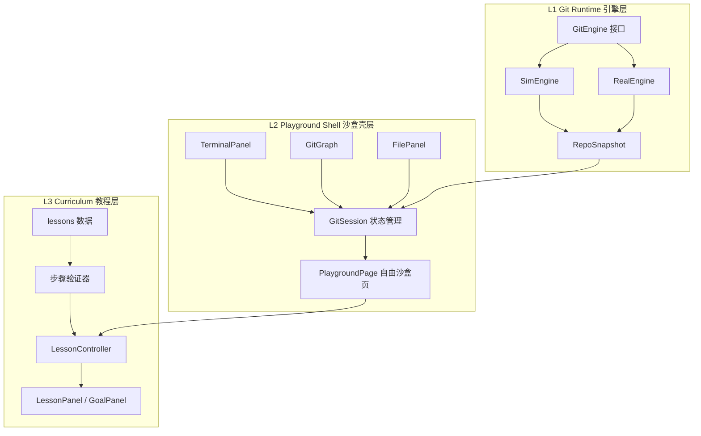
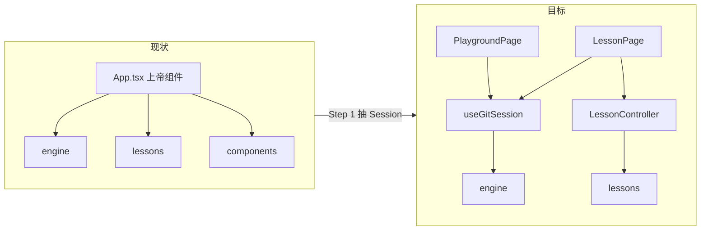
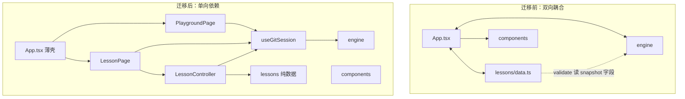

# 先沙盒后教程：架构判断与迁移指南

> 本文回答一个问题：**是否应该先把「网页上的 Git 命令行 + 可视化」做成可独立运行的平台，再叠加教程？**  
> 结论：**应该。** 当前项目把三层揉在一起，导致引擎、UI、课程互相牵制。本文给出目标架构、建设顺序，以及从现有代码迁移的路径。

---

## 第 1 章：问题陈述

### 1.1 你的直觉为什么是对的

参考 [git-sim](https://github.com/initialcommit-com/git-sim) 和 [Learn Git Branching](https://learngitbranching.js.org/)，它们表面上都是「左边终端 + 右边 Git 图」，但内核分工不同：

| 产品 | 核心能力 | 教程角色 |
|------|----------|----------|
| git-sim | 命令 → 仓库状态 → 可视化动画 | 无（或很弱） |
| Learn Git Branching | 独立沙盒 + 关卡验证 + 目标图对比 | 强，但叠在沙盒之上 |
| 本项目（现状） | 外观像 LGB，内核却是「关卡驱动引擎」 | 与运行时深度绑定 |

**正确的产品顺序应是：**

1. 先有一个**能在网页里玩 Git 的沙盒**（命令行 + Graph + 文件状态）
2. 确认这个沙盒本身好用、好看、命令覆盖够
3. 再在上面**插一层教程**（提示、验证、进度、目标窗）

把教程和运行时一起做，会出现你已遇到的典型返工：

- 终端历史要保留，但切关会 `router.reset()`，仓库状态被课程牵着走
- Sim 引擎按关卡零散加命令（`stash`、`upstreamSet` 等），而不是按「真实 Git 能力表」扩展
- `App.tsx` 的 `onCommand` 同时处理 `git *`、`levels`、`hint`、`reset` 和步骤 `validate`
- 改 UI 主题、改终端行为，都要考虑会不会影响「过关判定」

### 1.2 设计原则

1. **平台可独立演示**：关掉所有课程 UI，网站仍然是一个完整的 Git 沙盒
2. **教程可插拔**：课程是「壳」，不是引擎的驱动力
3. **引擎为 Git 建模，不为关卡建模**：`RepoSnapshot` 描述仓库真相，不承载教学进度

---

## 第 2 章：目标架构（三层模型）



### L1 — Git Runtime（引擎层）

**职责：**

- 接收一行 shell 风格命令（如 `git commit -m "init"`）
- 更新内部仓库模型
- 返回：终端输出文本 + `RepoSnapshot` + 动画事件

**不负责：**

- 第几关、是否过关、提示文案
- 顶栏「上一关 / 下一关」
- 终端里输入 `hint` 该显示什么

**现有资产：**

- `src/engine/types.ts` — `GitEngine` 接口
- `src/engine/snapshot.ts` — `RepoSnapshot` 统一状态模型
- `src/engine/sim/simEngine.ts` — 模拟引擎
- `src/engine/real/realEngine.ts` — isomorphic-git 真实引擎
- `src/engine/router.ts` — Sim / Real 路由

### L2 — Playground Shell（沙盒壳层）

**职责：**

- 布局：终端 + Graph View + 文件状态
- 维护 `GitSession`：当前 snapshot、终端历史、引擎模式
- 提供**自由沙盒页**：用户随便敲命令，右侧图实时变化
- 主题、音效、窗口装饰等「壳」能力

**默认首页应是沙盒，不是第一课。**

**现有资产（大部分可直接归入本层）：**

- `src/components/TerminalPanel.tsx`
- `src/components/GitGraph.tsx`
- `src/components/FilePanel.tsx`
- `src/components/WindowChrome.tsx`
- `src/viz/layout.ts`
- `src/App.css` / `src/index.css`

### L3 — Curriculum（教程层）

**职责：**

- 关卡数据：World / Step 的标题、说明、建议命令
- 步骤验证：根据 snapshot + 本次命令判断是否过关
- 教程 UI：LessonPanel、GoalPanel、进度持久化
- 元命令：`levels`、`hint`、课程专用 `reset`

**可整块隐藏。** 用户进入「自由沙盒」模式时，这一层不渲染。

**现有资产：**

- `src/lessons/data.ts` — 13 个 World
- `src/lessons/types.ts`、`src/lessons/helpers.ts`
- `src/components/LessonPanel.tsx`、`src/components/GoalPanel.tsx`

---

## 第 3 章：推荐建设流程（分阶段）

不要跳阶段。每一阶段都有独立验收标准，通过后再做下一层。

| 阶段 | 目标 | 验收标准 |
|------|------|----------|
| **P0 沙盒 MVP** | 无课程 UI 也能玩 | 用户可完成 init → add → commit → branch → merge → push；Graph 与文件区实时同步 |
| **P1 引擎契约稳定** | API 冻结，按 Git 能力表扩展 | `GitEngine` 接口不再为大改；新命令来自「常用命令清单」，而非某个 World 临时需求 |
| **P2 可视化达标** | 体验接近 git-sim / LGB | 节点动画、分支标签、空状态清晰；暗色模式下图可读 |
| **P3 教程插件化** | 教程是可选模式 | 顶栏或路由可切换「沙盒 / 课程」；切关不无条件 reset 整个仓库（改用 seed） |
| **P4 课程内容** | 批量编写关卡 | validator 与 data 分离；支持目标图对比（LGB 粉窗完整版） |

**当前项目大致处于：** P0 后半 + P3 未做 + P4 先行（13 个 World 已写，但平台层未独立）。

---

## 第 4 章：当前项目资产盘点

### 4.1 典型耦合点（迁移时必须解开）

**① `App.tsx` 上帝组件**

`onCommand` 一条链路同时做四件事：

1. 播放音效
2. 拦截 `levels` / `hint` / `reset`
3. 调用 `router.execute` 执行 git 命令
4. 调用 `currentStep.validate` 推进关卡

**② 切关强制 reset 仓库**

```ts
// App.tsx — worldIndex 变化时
router.setMode(mode);
router.reset().then(setSnapshot);
```

终端历史已改为追加保留，但**仓库状态仍被课程重置**。这不是独立沙盒的行为。

**③ 课程数据倒逼引擎**

`lessons/data.ts` 里的 `validate` 直接读 `snapshot.stashCount`、`snapshot.upstreamSet` 等字段，导致 Sim 引擎为过关而加状态，而非为 Git 真实性建模。

### 4.2 可复用 vs 需拆分

| 分类 | 文件 | 处置 |
|------|------|------|
| 保留 · L1 | `engine/*` | 继续作为运行时，逐步「去教学化」 |
| 保留 · L2 | `TerminalPanel`、`GitGraph`、`FilePanel`、`WindowChrome`、`viz/*` | 迁入 Playground |
| 保留 · L3 | `lessons/*`、`LessonPanel`、`GoalPanel` | 迁入 Lesson 模块，与 Session 解耦 |
| 拆分 | `App.tsx` | 拆为 `GitSession` + `PlaygroundPage` + `LessonPage` |
| 新增 | `playground/`、`lesson/controller.ts`、`hooks/useGitSession.ts` | 见附录目录对照 |

---

## 第 5 章：迁移路线图（四步，避免大爆炸）



### Step 1 — 抽出 GitSession（约 1–2 天）

从 `App.tsx` 抽出：

- `snapshot` / `setSnapshot`
- `terminalHistory`
- `runGitCommand(command)` — 只负责引擎调用与历史追加
- `resetRepo()` — 只重置仓库，不动课程进度

`App.tsx` 变薄，只负责布局和模式切换。

### Step 2 — 拆 LessonController（约 1–2 天）

- 新建 `src/lesson/controller.ts`
- `validate(step, snapshot, command)` 从 `data.ts` 内联函数迁出
- `onCommand` 教程逻辑搬入 controller：`hint`、`levels`、步骤推进
- World 切换改为加载 **RepoSeed**（预设场景），而非无条件 `router.reset()`

### Step 3 — 双模式 / 双页面（约 1 天）

顶栏增加：**自由沙盒 | 课程模式**

| 模式 | 显示 | 行为 |
|------|------|------|
| 自由沙盒（默认） | 终端 + Graph + 文件 | 无 LessonPanel / GoalPanel；reset 只清仓库 |
| 课程模式 | 上述 + 课程 UI | 加载当前 World；validator 工作 |

可用 react-router（`/`` 与 `/learn`）或简单 `appMode` state，首版不必上路由库。

### Step 4 — 引擎去教学化（持续）

- 评估 `RepoSnapshot` 中 `stashCount`、`upstreamSet`、`hasGitignore` 是否应留在引擎内部
- validator 尽量只依赖「Git 通用可观测状态」（commits、refs、head、index、workingTree）
- Real 引擎保持精简；课程步骤标注 `engine: "sim" | "real"`

---

## 第 6 章：关键接口草案

以下为迁移时的目标契约（伪代码，非当前实现）：

```ts
// —— L1：引擎层 ——
interface GitEngine {
  execute(cmd: string): Promise<EngineResult>;
  reset(seed?: RepoSeed): Promise<RepoSnapshot>;
  getSnapshot(): RepoSnapshot;
  getCompletions(input: string): string[];
}

// —— L2：沙盒会话 ——
interface GitSession {
  snapshot: RepoSnapshot;
  history: string[];
  mode: "sim" | "real";
  run(command: string): Promise<EngineResult>;
  resetRepo(seed?: RepoSeed): Promise<void>;
  setMode(mode: "sim" | "real"): void;
}

// —— L3：教程控制 ——
type StepResult = "advance" | "stay" | "complete";

interface LessonController {
  worldId: string;
  stepIndex: number;
  onGitResult(snapshot: RepoSnapshot, command: string): StepResult;
  loadWorld(worldId: string): Promise<void>;  // 注入 seed，非盲目 reset
  handleMetaCommand(cmd: "levels" | "hint" | "reset"): string[];
}
```

**依赖方向（必须单向）：**

```
L3 LessonController → 调用 → L2 GitSession → 调用 → L1 GitEngine
```

不允许 `simEngine` import `lessons/data`。

---

## 第 7 章：风险与取舍

### Sim vs Real

- **沙盒默认 Sim**：覆盖广、响应快、适合教学与演示
- **Real 作为「实验室」**：浏览器内真实 git，命令集少，不应用于每一关硬切
- 教程步骤显式标注 `mode: "sim" | "real"`，避免用户在新手关遇到 `real 模式暂不支持 git stash`

### 教程验证粒度

| 级别 | 做法 | 适用 |
|------|------|------|
| L-1 命令匹配 | `command.startsWith("git commit")` | 快速原型（当前大量用法） |
| L-2 快照断言 | `snapshot.commits.length >= 1` | 中期目标 |
| L-3 目标图对比 | 当前 Graph vs 目标 Graph | LGB 粉窗完整版，后期再做 |

建议 P3 之前维持 L-1/L-2，不要为 L-3 提前改引擎。

### 不要一次性重写

- 现有 13 个 World **挂到新的 LessonPage 下即可**，逐步改 validator
- 视觉换肤（LGB 风格）、夜间模式、终端历史保留 —— 都属于 L2，与本次架构调整正交，可保留

---

## 第 8 章：下一步行动清单

### 如果你只想做一件事

> **把 `App.tsx` 拆成 `PlaygroundPage` + `LessonPage`，并抽出 `useGitSession`。**

这是投入产出比最高的一步：不改变现有课程内容，但立刻让「沙盒」在概念上独立出来。

### 推荐执行顺序

1. 新建 `src/hooks/useGitSession.ts`（从 App 搬 snapshot / history / run）
2. 新建 `src/playground/PlaygroundPage.tsx`（无课程 UI 的纯沙盒）
3. 新建 `src/lesson/LessonPage.tsx`（包 Playground + LessonPanel + GoalPanel）
4. `App.tsx` 只做：顶栏、模式切换、主题、音效
5. 顶栏默认进入「自由沙盒」

### 明确暂缓

- 不再新增 World
- 不再为单一关卡扩展 Sim 命令
- 不做目标图自动对比（LGB 粉窗完整版）

---

## 附录 A：迁移前后依赖对比



---

## 附录 B：目录结构对照表

### 现状（`src/`）

```
src/
├── App.tsx              # 上帝组件：引擎 + 课程 + 布局 + 主题
├── App.css
├── main.tsx
├── index.css
├── engine/              # L1（但被课程牵着走）
├── components/          # L2 UI + L3 UI 混在一起
├── lessons/             # L3 数据 + validate 逻辑
└── viz/                 # L2 可视化布局
```

### 目标（建议）

```
src/
├── App.tsx                    # 薄壳：路由/模式、顶栏、主题
├── app/
│   └── AppShell.tsx           # 布局骨架（Allotment）
├── hooks/
│   └── useGitSession.ts       # L2 会话状态
├── playground/
│   └── PlaygroundPage.tsx     # L2 自由沙盒（默认首页）
├── lesson/
│   ├── LessonPage.tsx         # L3 课程页（包一层 Playground）
│   ├── controller.ts          # L3 验证与元命令
│   └── validator.ts           # L3 从 data.ts 抽出的纯函数
├── engine/                    # L1 不变
├── components/                # L2 通用 UI（终端、Graph、文件、窗口）
├── lessons/                   # L3 纯数据（无 validate 内联）
└── viz/                       # L2 图布局算法
```

| 现状路径 | 目标归属 | 说明 |
|----------|----------|------|
| `engine/sim/simEngine.ts` | L1 | 保留，按 Git 能力表扩展 |
| `engine/real/realEngine.ts` | L1 | 保留，沙盒实验室 |
| `components/TerminalPanel.tsx` | L2 | 不变 |
| `components/GitGraph.tsx` | L2 | 不变 |
| `components/LessonPanel.tsx` | L3 | 仅 LessonPage 引用 |
| `components/GoalPanel.tsx` | L3 | 仅 LessonPage 引用 |
| `lessons/data.ts` | L3 | validate 迁出到 `validator.ts` |
| `App.tsx` 内 onCommand | 拆分到 L2 + L3 | 最关键迁移点 |

---

## 附录 C：P0–P4 验收标准与检查清单

### P0 沙盒 MVP

- [ ] 隐藏 LessonPanel / GoalPanel 后，网站仍是完整可用产品
- [ ] 用户可在终端连续执行：init → add → commit → log → branch → checkout → merge
- [ ] Graph 与 FilePanel 每次命令后更新
- [ ] 手动「重置仓库」按钮可用，不依赖课程 reset

### P1 引擎契约稳定

- [ ] `GitEngine` 接口 2 周内无破坏性变更
- [ ] 新命令来自文档化「命令能力表」，而非单个 World 需求
- [ ] `RepoSnapshot` 字段有注释说明「Git 语义」，而非「教学语义」

### P2 可视化达标

- [ ] 空仓库、单提交、多分支、merge 节点样式清晰
- [ ] 日间 / 夜间模式下 Graph 可读
- [ ] 动画事件（CommitCreated、RefMoved 等）与 Graph 同步

### P3 教程插件化

- [ ] 顶栏可切换「自由沙盒 / 课程模式」
- [ ] 默认进入自由沙盒
- [ ] 切关使用 RepoSeed，不无条件 `router.reset()`
- [ ] `levels` / `hint` 仅在课程模式响应

### P4 课程内容

- [ ] validator 与 `lessons/data.ts` 分离
- [ ] 支持按 World 配置初始场景
- [ ] （可选）GoalPanel 展示目标 Graph 对比

### 第一步代码任务（P0 入口）

| 序号 | 任务 | 文件 | 预估 |
|------|------|------|------|
| 1 | 抽出 `useGitSession` | `src/hooks/useGitSession.ts` | 0.5d |
| 2 | 实现 `PlaygroundPage` | `src/playground/PlaygroundPage.tsx` | 0.5d |
| 3 | 实现 `LessonPage` 包装现有课程 UI | `src/lesson/LessonPage.tsx` | 0.5d |
| 4 | App 改为模式切换 + 薄布局 | `src/App.tsx` | 0.5d |
| 5 | 顶栏增加「沙盒 / 课程」切换 | `src/App.tsx` | 0.25d |

---

## 结语

当前项目**不是方向错了**，而是**层序反了**：在平台尚未独立时，就按教程需求驱动引擎和 UI，导致每次改终端、改主题、改切关逻辑都要兼顾「会不会影响过关」。

迁移的核心不是推倒重来，而是：

1. **把已有的 engine 和 components 认作平台资产**
2. **把 App.tsx 里的课程逻辑抽到 LessonController**
3. **让默认体验变成「自由沙盒」，课程变成可选模式**

做完 Step 1–3 后，你再写新 World、新命令、新可视化，都会比现在轻松得多。
